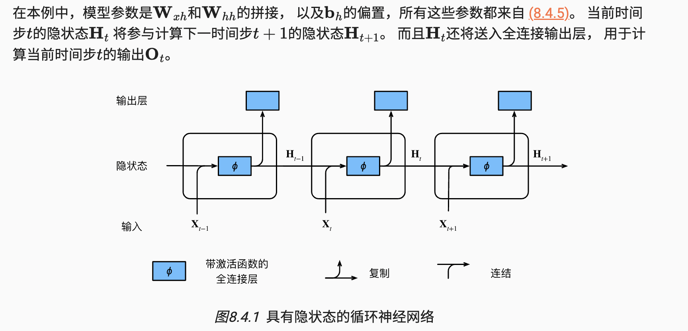
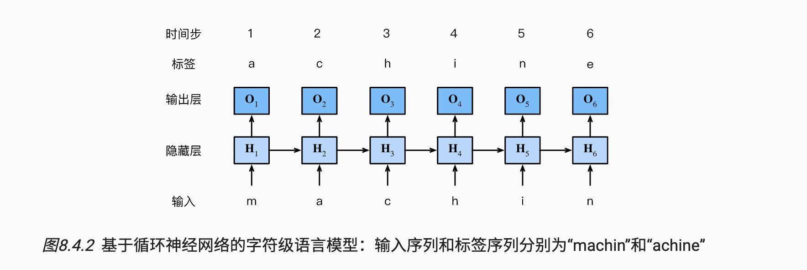
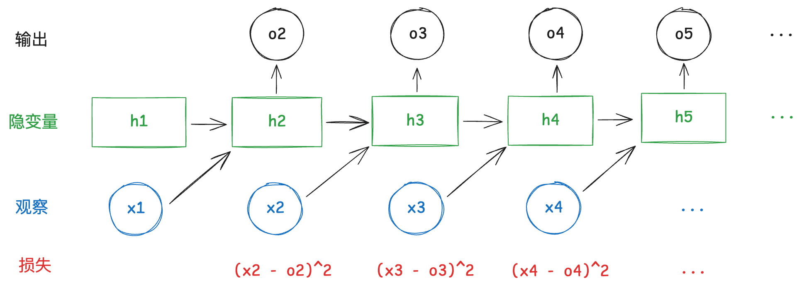
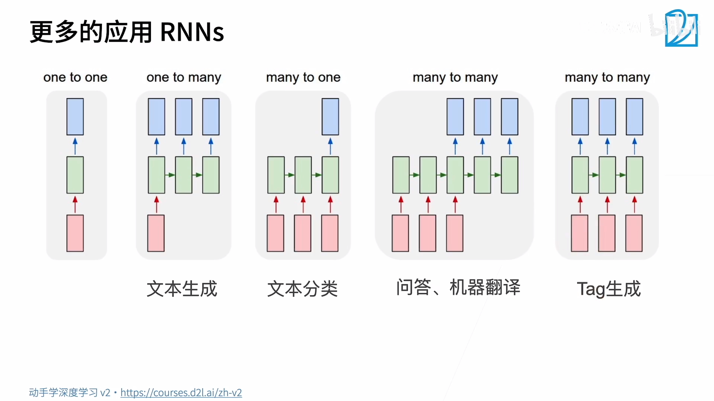
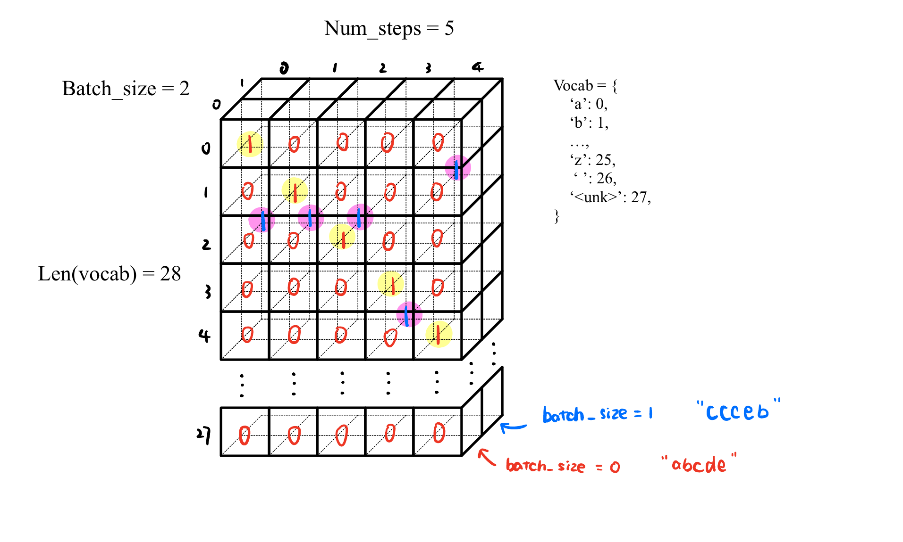
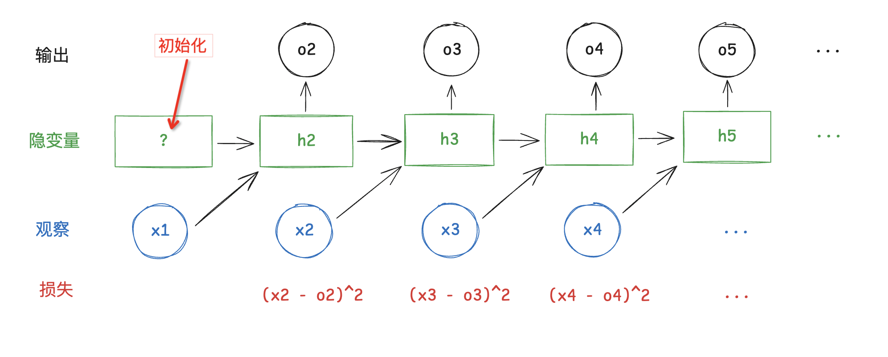
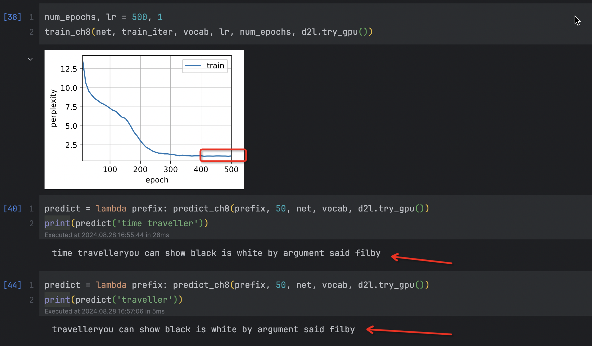
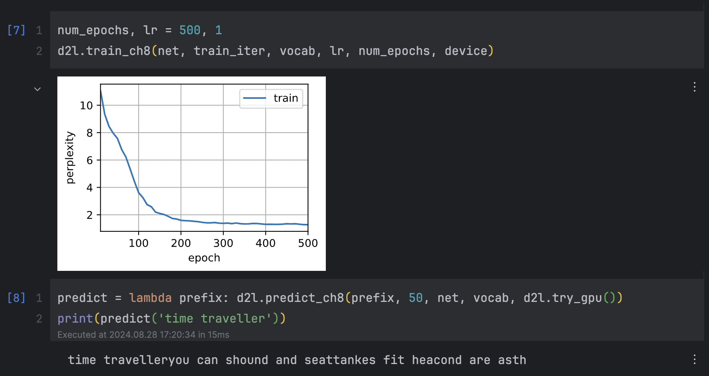

# 循环神经网络RNN


## 1 循环神经网络知识

### 1. 无隐状态的神经网络

完全类似于之前在`序列模型`中解决的回归问题，只要可以随机选择“特征-标签”对， 并且通过自动微分和随机梯度下降能够学习网络参数就可以了。


### 2. 有隐状态的循环神经网络

假设我们在时间步$t$有小批量输入$\mathbf{X}_t \in \mathbb{R}^{n \times d}$。换言之，对于$n$个序列样本的小批量，$\mathbf{X}_t$的每一行对应于来自该序列的时间步$t$处的一个样本。接下来，用$\mathbf{H}_t  \in \mathbb{R}^{n \times h}$表示时间步$t$的隐藏变量。与多层感知机不同的是，我们在这里保存了前一个时间步的隐藏变量$\mathbf{H}_{t-1}$，并引入了一个新的权重参数$\mathbf{W}_{hh} \in \mathbb{R}^{h \times h}$，来描述如何在当前时间步中使用前一个时间步的隐藏变量。

- 具体地说，`当前时间步隐藏变量`由`当前时间步的输入`与`前一个时间步的隐藏变量`一起计算得出：

$$
\mathbf{H}_t = \phi(\mathbf{X}_t \mathbf{W}_{xh} + \mathbf{H}_{t-1} \mathbf{W}_{hh}  + \mathbf{b}_h)
$$

- 输出则类似与多层感知机的输出：

$$
\mathbf{O}_t = \mathbf{H}_t \mathbf{W}_{hq} + \mathbf{b}_q
$$



- 代码案例

首先，我们定义矩阵`X`、`W_xh`、`H`和`W_hh`， 它们的形状分别为，(3，1)、，(1，4)、，(3，4)和，(4，4)。 分别将`X`乘以`W_xh`，将`H`乘以`W_hh`， 然后将这两个乘法相加，我们得到一个形状为，(3，4)的矩阵。

```python
import torch
from d2l import torch as d2l

X, W_xh = torch.normal(0, 1, (3, 1)), torch.normal(0, 1, (1, 4))
H, W_hh = torch.normal(0, 1, (3, 4)), torch.normal(0, 1, (4, 4))
torch.matmul(X, W_xh) + torch.matmul(H, W_hh)
```

```python
>>> tensor([[-1.6506, -0.7309,  2.0021, -0.1055],
>>>         [ 1.7334,  2.2035, -3.3148, -2.1629],
>>>         [-2.0071, -1.0902,  0.2376, -1.3144]])
```

现在，我们沿列（轴1）拼接矩阵`X`和`H`， 沿行（轴0）拼接矩阵`W_xh`和`W_hh`。 这两个拼接分别产生形状(3,5)和形状(5,4)的矩阵。 再将这两个拼接的矩阵相乘， 我们得到与上面相同形状(3,4)的输出矩阵。

```python
torch.matmul(torch.cat((X, H), 1), torch.cat((W_xh, W_hh), 0))
```

```python
>>> tensor([[-1.6506, -0.7309,  2.0021, -0.1055],
>>>         [ 1.7334,  2.2035, -3.3148, -2.1629],
>>>         [-2.0071, -1.0902,  0.2376, -1.3144]])
```


### 3. 基于循环神经网络的字符级语言模型

语言模型：我们的目标是根据过去的和当前的词元预测下一个词元， 因此我们将原始序列移位一个词元作为标签。

设小批量大小为1，批量中的文本序列为“machine”。 为了简化后续部分的训练，我们考虑使用 *字符级语言模型*（character-level language model）， 将文本词元化为字符而不是单词。下图演示了 如何通过基于字符级语言建模的循环神经网络， 使用当前的和先前的字符预测下一个字符。





在训练过程中，我们对每个时间步的输出层的输出进行softmax操作， 然后利用交叉熵损失计算模型输出和标签之间的误差。 例如，第3个时间步的输出$O_3$由文本序列“m”“a”和“c”确定。 由于训练数据中这个文本序列的下一个字符是“h”， 因此第3个时间步的损失将取决于下一个字符的概率分布， 而下一个字符是基于特征序列“m”“a”“c”和这个时间步的标签“h”生成的。

在实践中，我们使用的批量大小为n>1， 每个词元都由一个d维向量表示。 因此，在时间步t输入$X_t$将是一个$n×d$矩阵。


### 4. 困惑度Perplexity

我们可以通过一个序列中所有的n个词元的交叉熵损失的平均值来衡量：
$$
\pi = \frac{1}{n} \sum_{t=1}^n -\log P(x_t \mid x_{t-1}, \ldots, x_1)
$$
其中P由语言模型给出， $x_t$ 是在时间步 $ t $ 从该序列中观察到的`实际词元`。 这使得不同长度的文档的性能具有了可比性。 由于历史原因，自然语言处理的科学家更喜欢使用一个叫做*困惑度*（perplexity）的量。 简而言之，它是 [(3)](##4 困惑度Perplexity)的指数：
$$
\exp\left(-\frac{1}{n} \sum_{t=1}^n \log P(x_t \mid x_{t-1}, \ldots, x_1)\right)
$$
困惑度的最好的理解是“下一个词元的实际选择数的调和平均数”。 我们看看一些案例。

- 在`最好`的情况下，模型总是完美地估计标签词元的概率为`1`。 在这种情况下，模型的困惑度为`1`。
- 在`最坏`的情况下，模型总是预测标签词元的概率为`0`。 在这种情况下，困惑度是`正无穷大`。
- 在基线上，该模型的预测是词表的所有可用词元上的均匀分布。 在这种情况下，困惑度等于词表中唯一词元的数量。 事实上，如果我们在没有任何压缩的情况下存储序列， 这将是我们能做的最好的编码方式。 因此，这种方式提供了一个重要的上限， 而任何实际模型都必须超越这个上限。

$$
1 \leq exp(\pi) \leq +\infty
$$


### 5. 梯度裁剪Gradient Clipping

对于长度为T的序列，我们在迭代中计算这T个时间步上的梯度， 将会在反向传播过程中产生长度为O(T)的矩阵乘法链，当T较大时，它可能导致数值不稳定。

- 有时梯度可能很大，从而优化算法可能无法收敛。 我们可以通过`降低η的学习率`来解决这个问题。 

- 但是如果我们很少得到大的梯度呢？ 在这种情况下，这种做法似乎毫无道理。 一个流行的替代方案是通过将梯度 `g` (这里的g是所有层储存的梯度)投影回给定半径 (例如 `θ` )的球来裁剪梯度 `g` 。 如下式：

$$
\mathbf{g} \leftarrow \min\left(1, \frac{\theta}{\|\mathbf{g}\|}\right) \mathbf{g}
$$

```python
def grad_clipping(net, theta):  #@save
    """裁剪梯度"""
    if isinstance(net, nn.Module):
        params = [p for p in net.parameters() if p.requires_grad]
    else:
        params = net.params
    norm = torch.sqrt(sum(torch.sum((p.grad ** 2)) for p in params))
    if norm > theta:
        for param in params:
            param.grad[:] *= theta / norm
```


### 6. 更多应用RNNs




## 2 RNN从零开始编程

### 1. 导入数据

从头开始基于循环神经网络实现字符级语言模型。 这样的模型将在H.G.Wells的时光机器数据集上训练。 和前面中介绍过的一样， 我们先读取数据集。

```python
%matplotlib inline
import math
import torch
from torch import nn
from torch.nn import functional as F
from d2l import torch as d2l

batch_size, num_steps = 32, 35
'''
batch_size: 小批量大小，即每次输入的样本数
num_steps: 跨度，每个样本的字符个数，输入的特征
'''

# d2l打包的函数load_data_time_machine
train_iter, vocab = d2l.load_data_time_machine(batch_size, num_steps)
```


### 2. 独热编码

假设词表中不同词元的数目为N（即`len(vocab)`）， 词元索引的范围为0到N−1。 如果词元的索引是整数i， 那么我们将创建一个长度为N的全0向量， 并将第i处的元素设置为1。

>  索引为0和2的独热向量如下所示：

```python
F.one_hot(torch.tensor([0, 2]), len(vocab))  # len(vocab)为28，26个字母+' '+'<unk>'
```

```python
>>> tensor([[1, 0, 0, 0, 0, 0, 0, 0, 0, 0, 0, 0, 0, 0, 0, 0, 0, 0, 0, 0, 0, 0, 0, 0,
>>>          0, 0, 0, 0],
>>>         [0, 0, 1, 0, 0, 0, 0, 0, 0, 0, 0, 0, 0, 0, 0, 0, 0, 0, 0, 0, 0, 0, 0, 0,
>>>          0, 0, 0, 0]])
```

- 我们每次采样的小批量数据形状是二维张量： `（批量大小，时间步数）`。
    - 批量大小：相当于一个一个的字符组成的字符串`样本`
    - 时间步数：相当于每个样本的字符总个数，也可以看作输入的`特征`。采用one-hot后，就会映射到28个字符的是否01向量

`one_hot`函数将这样一个小批量数据转换成三维张量， 张量的最后一个维度等于词表大小（`len(vocab)`）。 我们经常转置输入的维度，以便获得形状为 `（时间步数，批量大小，词表大小）`的输出。

> 类似如下的例子

```python
X = torch.arange(10).reshape((2, 5))
F.one_hot(X.T, 28).shape
```

```python
>>> torch.Size([5, 2, 28])
```




### 3. 初始化模型参数

隐藏单元数`num_hiddens`是一个可调的超参数。 当训练语言模型时，输入和输出来自相同的词表。 因此，它们具有相同的维度，即词表的大小。

```python
def get_params(vocab_size, num_hiddens, device):
    num_inputs = num_outputs = vocab_size

    def normal(shape):
        return torch.randn(size=shape, device=device) * 0.01

    # 隐藏层参数
    W_xh = normal((num_inputs, num_hiddens))
    W_hh = normal((num_hiddens, num_hiddens))  # 和MLP唯一的区别
    b_h = torch.zeros(num_hiddens, device=device)
    # 输出层参数
    W_hq = normal((num_hiddens, num_outputs))
    b_q = torch.zeros(num_outputs, device=device)
    # 附加梯度
    params = [W_xh, W_hh, b_h, W_hq, b_q]
    for param in params:
        param.requires_grad_(True)
    return params
```

- 输入`num_inputs`: [0, 0, 1, 0, ..., 0]是独热编码后的一个个向量，维度是vicab_size，这里是28
- 输出`num_outputs`: 输出也应该从vocab里面选择字符，这里有28个字符类别可以选择


### 4. 循环神经网络模型

- 为了定义循环神经网络模型， 我们首先需要一个`init_rnn_state`函数在初始化时返回隐状态。

 这个函数的返回是一个张量，张量全用0填充， 形状为`（批量大小，隐藏单元数）`。 在后面的章节中我们将会遇到隐状态包含多个变量的情况， 而使用元组可以更容易地处理些。

```python
# 得到W_hh矩阵
def init_rnn_state(batch_size, num_hiddens, device):
    return (torch.zeros((batch_size, num_hiddens), device=device),)
```



- 下面的`rnn`函数定义了如何在一个时间步内计算隐状态和输出。

 循环神经网络模型通过`inputs`最外层的维度实现循环， 以便逐时间步更新小批量数据的隐状态`H`。 此外，这里使用tanh函数作为激活函数。 如 [4.1节](https://zh-v2.d2l.ai/chapter_multilayer-perceptrons/mlp.html#sec-mlp)所述， 当元素在实数上满足均匀分布时，tanh函数的平均值为0。

```python
def rnn(inputs, state, params):
    '''
    RNN cell
    :param inputs: 批量输入特征 形状：(时间步数量，批量大小，词表大小)
    :param state: 初始状态
    :param params: 可学习参数
    :return: 当前的输出和当前的隐藏状态，输出形状：行仍然代表vocab的one-hot编码元素，列按照时间步重新拼在一起
    '''
    # inputs的形状：(时间步数量，批量大小，词表大小)
    W_xh, W_hh, b_h, W_hq, b_q = params
    H, = state
    outputs = []
    # X的形状：(批量大小，词表大小)
    for X in inputs:
        # 时刻0的样本和样本字符列表，时刻1的样本和样本字符列表，...
        H = torch.tanh(torch.mm(X, W_xh) + torch.mm(H, W_hh) + b_h)
        Y = torch.mm(H, W_hq) + b_q  # 当前时刻的输入和隐变量预测出的下一时刻的输出
        outputs.append(Y)
    return torch.cat(outputs, dim=0), (H,)
```


- 定义了所有需要的函数之后，接下来我们创建一个类来包装这些函数， 并存储从零开始实现的循环神经网络模型的参数。

```python
class RNNModelScratch:  #@save
    """从零开始实现的循环神经网络模型"""

    def __init__(self, vocab_size, num_hiddens, device, get_params, init_state, forward_fn):
        self.vocab_size, self.num_hiddens = vocab_size, num_hiddens
        self.params = get_params(vocab_size, num_hiddens, device)
        self.init_state, self.forward_fn = init_state, forward_fn
        # forward_fn前向传播函数，这里可以传刚才定义的rnn函数

    def __call__(self, X, state):
        X = F.one_hot(X.T, self.vocab_size).type(torch.float32)
        return self.forward_fn(X, state, self.params)

    def begin_state(self, batch_size, device):
        return self.init_state(batch_size, self.num_hiddens, device)
```


### 5. 检查输出是否具有正确的形状

> [!CAUTION]
>
> 这里我们取了 `X = torch.arange(10).reshape((2, 5))`作为检查例子，实际在[导入数据](###1. 导入数据)时，我们假设的超参数是`batch_size, num_steps = 32, 35`

```python
num_hiddens = 512
net = RNNModelScratch(
    len(vocab),
    num_hiddens,
    d2l.try_gpu(),
    get_params,
    init_rnn_state,
    rnn
)

# 生成检查数据
X = torch.arange(10).reshape((2, 5))
# 初始化第0个隐藏状态
state = net.begin_state(X.shape[0], d2l.try_gpu())

Y, new_state = net(X.to(d2l.try_gpu()), state)

print(Y.shape)
print(len(new_state))
print(new_state[0].shape)
```

```python
>>> (torch.Size([10, 28])  # 10 = 5 * 2 = num_steps * batch_size, 说明输出Y把输入X的两个样本计算出的结果都拼在了一起
>>> 1
>>> torch.Size([2, 512]))  # 当前隐藏状态
```

注意到

```python
X = torch.arange(10).reshape((2, 5))
F.one_hot(X.T, 28).shape
>>> torch.Size([5, 2, 28])
```

- `10 = 5 * 2 = num_steps * batch_size`, 说明输出Y把输入X的两个样本计算出的结果都拼在了一起


### 6. 预测

让我们首先定义预测函数来生成`prefix`之后的新字符， 其中的`prefix`是一个用户提供的包含多个字符的字符串。

在循环遍历`prefix`中的开始字符时， 我们不断地将隐状态传递到下一个时间步，但是不生成任何输出。 这被称为*预热*（warm-up）期， 因为在此期间模型会自我更新（例如，更新隐状态）， 但不会进行预测。 预热期结束后，隐状态的值通常比刚开始的初始值更适合预测， 从而预测字符并输出它们。

```python
def predict_ch8(prefix, num_preds, net, vocab, device):  #@save
    """
    
    :param prefix: prefix是一个用户提供的包含多个字符的字符串，该函数根据这个prefix生成之后的字符串 
    :param num_preds: 需要生成的字符/字符串长度
    :param net: 网络模型
    :param vocab: 词汇表，根据vacab实现one-hot编码向字符的转变
    :param device: cpu或gpu
    :return: 生成的字符串
    """
    """在prefix后面生成新字符"""

    state = net.begin_state(batch_size=1, device=device)  # batch_size=1 是因为只要生成一个字符串
    outputs = [vocab[prefix[0]]]  # 只是把用户输入的字符对应的标号放在开头而已，并无特殊含义 e.g. [4, ]

    # 定义函数get_input()，每次拿到outputs的最后一个词，转换成tensor
    get_input = lambda: torch.tensor([outputs[-1]], device=device).reshape((1, 1))
    # def get_input():
    #     return torch.tensor([outputs[-1]], device=device).reshape((1, 1))

    for y in prefix[1:]:  # 预热期，利用输入的prefix的信息不断完善隐状态state，并把完整的prefix存入outputs，并不在意预测值
        _, state = net(get_input(), state)
        outputs.append(vocab[y])  # e.g. [4, 3, 2, ...]

    # 预测num_preds步
    for _ in range(num_preds):
        y, state = net(get_input(), state)
        outputs.append(int(y.argmax(dim=1).reshape(1)))  # 分类问题，找到len(vocab)个元素中最大的的下标，加入outputs

    return ''.join([vocab.idx_to_token[i] for i in outputs])  # vocab.idx_to_token[i]在词汇表中把标号转为字符，然后输出
```

现在我们可以测试`predict_ch8`函数。 我们将前缀指定为`time traveller`， 并基于这个前缀生成10个后续字符。 鉴于我们还没有训练网络，它会生成荒谬的预测结果。

```python
predict_ch8('time traveller ', 10, net, vocab, d2l.try_gpu())
>>> 'time traveller djzyqrjzyq'  # 未训练的模型
```


### 7. 辅助函数-梯度裁剪

[见前](###5. 梯度裁剪Gradient Clipping)
$$
\mathbf{g} \leftarrow \min\left(1, \frac{\theta}{\|\mathbf{g}\|}\right) \mathbf{g}
$$

```python
def grad_clipping(net, theta):  #@save
    """裁剪梯度"""

    # 拿出所有需要学习的参数，即需要requires_grad==True
    if isinstance(net, nn.Module):  # 如果采用简洁写法nn.Module
        params = [p for p in net.parameters() if p.requires_grad]
    else:  # 如果采用从零开始实现的方法
        params = net.params

    # 先把所有的学习参数拼成一个向量，然后直接求L2范数
    norm = torch.sqrt(sum(torch.sum((p.grad ** 2)) for p in params))
    
    if norm > theta:
        # 梯度太大，就把所有梯度同时缩放
        for param in params:
            param.grad[:] *= theta / norm
```


### 8. 开始训练

在训练模型之前，让我们定义一个函数`在一个迭代周期内训练模型`。 特殊之处：

1. 序列数据的不同采样方法（随机采样和顺序分区）将导致隐状态初始化的差异。
2. 我们在更新模型参数之前裁剪梯度。 这样的操作的目的是，即使训练过程中某个点上发生了梯度爆炸，也能保证模型不会发散。
3. 我们用[困惑度](###4. 困惑度Perplexity)来评价模型，这样的度量确保了不同长度的序列具有可比性。

具体来说，当使用`顺序分区`时， 我们只在每个迭代周期的开始位置初始化隐状态。 由于下一个小批量数据中的第`i`个子序列样本 与当前第`i`个子序列样本相邻， 因此当前小批量数据最后一个样本的隐状态， 将用于初始化下一个小批量数据第一个样本的隐状态。 这样，存储在隐状态中的序列的历史信息 可以在一个迭代周期内流经相邻的子序列。 然而，在任何一点隐状态的计算， 都依赖于同一迭代周期中前面所有的小批量数据， 这使得梯度计算变得复杂。 为了降低计算量，在处理任何一个小批量数据之前， 我们先分离梯度，使得隐状态的梯度计算总是限制在一个小批量数据的时间步内。

当使用`随机抽样`时，因为每个样本都是在一个随机位置抽样的， 因此需要为每个迭代周期重新初始化隐状态。 与 [3.6节](https://zh-v2.d2l.ai/chapter_linear-networks/softmax-regression-scratch.html#sec-softmax-scratch)中的 `train_epoch_ch3`函数相同， `updater`是更新模型参数的常用函数。 它既可以是从头开始实现的`d2l.sgd`函数， 也可以是深度学习框架中内置的优化函数。

> `顺序分区` 和 `随机抽样` 会导致隐藏状态不一样

```python
def train_epoch_ch8(net, train_iter, loss, updater, device, use_random_iter):
    '''
    
    :param net: 模型
    :param train_iter: 数据 
    :param loss: 损失
    :param updater: 优化器
    :param device: cpu或gpu
    :param use_random_iter: True随机抽样，False顺序分区 
    :return: 
    '''
    """训练网络一个迭代周期（定义见第8章）"""
    state, timer = None, d2l.Timer()
    metric = d2l.Accumulator(2)  # 训练损失之和,词元数量

    # 计算图 x -> s -> y 如果s.detach_() 则 x, s -> y 且设置s.requires_grad=False 即y.backward时不会求s的梯度
    for X, Y in train_iter:
        if state is None or use_random_iter:
            # 在第一次迭代初始化state 或 使用随机抽样时初始化state，因为对于随机抽样上一个state与这一次相互独立
            state = net.begin_state(batch_size=X.shape[0], device=device)
        else:
            if isinstance(net, nn.Module) and not isinstance(state, tuple):
                # state对于nn.GRU是个张量
                state.detach_()
            else:
                # state对于nn.LSTM或对于我们从零开始实现的模型是个张量
                for s in state:
                    s.detach_()

        y = Y.T.reshape(-1)
        X, y = X.to(device), y.to(device)
        y_hat, state = net(X, state)
        # y_hat和y都是batch_size * nun_steps长的tensor
        l = loss(y_hat, y.long()).mean()

        if isinstance(updater, torch.optim.Optimizer):
            updater.zero_grad()
            l.backward()
            grad_clipping(net, 1)  # 裁剪梯度 theta=1
            updater.step()
        else:
            l.backward()
            grad_clipping(net, 1)
            # 因为已经调用了mean函数
            updater(batch_size=1)
        
        # metric[0]存储总损失，metric[1]存储样本数量
        metric.add(l * y.numel(), y.numel())
    return math.exp(metric[0] / metric[1]), metric[1] / timer.stop()
```


#### - 通用训练函数

- 循环神经网络模型的训练函数既支持从零开始实现， 也可以使用高级API来实现。

```python
def train_ch8(net, train_iter, vocab, lr, num_epochs, device, use_random_iter=False):
    """训练模型（定义见第8章）"""
    loss = nn.CrossEntropyLoss()  # 实际上就是分类模型

    # 画图
    animator = d2l.Animator(xlabel='epoch', ylabel='perplexity', legend=['train'], xlim=[10, num_epochs])

    # 初始化
    # 优化器
    if isinstance(net, nn.Module):
        updater = torch.optim.SGD(net.parameters(), lr)
    else:
        updater = lambda batch_size: d2l.sgd(net.params, lr, batch_size)

    predict = lambda prefix: predict_ch8(prefix, 50, net, vocab, device)

    # 训练和预测
    for epoch in range(num_epochs):
        ppl, speed = train_epoch_ch8(net, train_iter, loss, updater, device, use_random_iter)
        if (epoch + 1) % 10 == 0:
            # 以'time traveller'为开头的训练
            print(predict('time traveller'))
            animator.add(epoch + 1, [ppl])

    print(f'困惑度 {ppl:.1f}, {speed:.1f} 词元/秒 {str(device)}')
    
    print(predict('time traveller'))  # 预测'time traveller'之后的生成
    print(predict('traveller'))  # 预测'traveller'之后的生成
```


#### - 实际训练

我们训练循环神经网络模型。 因为我们在数据集中只使用了10000个词元， 所以模型需要更多的迭代周期来更好地收敛。

```python
num_epochs, lr = 500, 1
train_ch8(net, train_iter, vocab, lr, num_epochs, d2l.try_gpu())
```



- 困惑率接近1，说明非常完美，因为书籍字数少，跌倒次数多，模型记住了整本书
- 预测的语句意思不对，是因为我们是对字符进行的训练，可以看到，构成的单词基本正确


最后，让我们检查一下使用随机抽样方法的结果。

```python
net = RNNModelScratch(len(vocab), num_hiddens, d2l.try_gpu(), get_params, init_rnn_state, rnn)
train_ch8(net, train_iter, vocab, lr, num_epochs, d2l.try_gpu(), use_random_iter=True)
```

```python
>>> 困惑度 1.5, 65222.3 词元/秒 cuda:0
>>> time traveller held in his hand was a glitteringmetallic framewo
>>> traveller but now you begin to seethe object of my investig
```


## 3 RNN简洁实现

### 1. 导入数据

```python
import torch
from torch import nn
from torch.nn import functional as F
from d2l import torch as d2l

batch_size, num_steps = 32, 35
train_iter, vocab = d2l.load_data_time_machine(batch_size, num_steps)
```

### 2. 定义模型

```python
num_hiddens = 256
rnn_layer = nn.RNN(len(vocab), num_hiddens)
```

使用张量来初始化隐状态,它的形状是（隐藏层数，批量大小，隐藏单元数）

```python
state = torch.zeros((1, batch_size, num_hiddens))
state.shape
```

```python
>>> torch.Size([1, 32, 256])  # （隐藏层数，批量大小，隐藏单元数）
```


### 3. 检查

```python
X = torch.rand(size=(num_steps, batch_size, len(vocab)))
Y, state_new = rnn_layer(X, state)

print(Y.shape)
print(state_new.shape)
```

隐藏层y形状是（时间步，批量大小，隐藏但元素）

```python
>>> (torch.Size([35, 32, 256])  # 输出y是（时间步，批量大小，隐藏但元素）
>>> torch.Size([1, 32, 256]))
```


### 4. RNN模型

为一个完整的循环神经网络模型定义了一个`RNNModel`类

注意，`rnn_layer`只包含隐藏的循环层，我们还需要创建一个单独的输出层。

```python
class RNNModel(nn.Module):
    """循环神经网络模型"""

    def __init__(self, rnn_layer, vocab_size, **kwargs):
        super(RNNModel, self).__init__(**kwargs)
        self.rnn = rnn_layer
        self.vocab_size = vocab_size
        self.num_hiddens = self.rnn.hidden_size

        # 如果RNN是双向的（之后将介绍），num_directions应该是2，否则应该是1
        if not self.rnn.bidirectional:
            self.num_directions = 1

            # 自定义输出层
            self.linear = nn.Linear(self.num_hiddens, self.vocab_size)

        else:
            self.num_directions = 2
            self.linear = nn.Linear(self.num_hiddens * 2, self.vocab_size)

    def forward(self, inputs, state):
        X = F.one_hot(inputs.T.long(), self.vocab_size)
        X = X.to(torch.float32)
        Y, state = self.rnn(X, state)
        # 全连接层首先将Y的形状改为(时间步数*批量大小,隐藏单元数)
        # 它的输出形状是(时间步数*批量大小,词表大小)
        output = self.linear(Y.reshape((-1, Y.shape[-1])))
        return output, state

    def begin_state(self, device, batch_size=1):
        if not isinstance(self.rnn, nn.LSTM):
            # nn.GRU以张量作为隐状态
            return torch.zeros((self.num_directions * self.rnn.num_layers,
                                batch_size, self.num_hiddens),
                               device=device)
        else:
            # nn.LSTM以元组作为隐状态
            return (torch.zeros((
                self.num_directions * self.rnn.num_layers,
                batch_size, self.num_hiddens), device=device),
                    torch.zeros((
                        self.num_directions * self.rnn.num_layers,
                        batch_size, self.num_hiddens), device=device))
```


### 5. 训练与预测

- 训练前：基于一个具有随机权重的模型进行预测

```python
device = d2l.try_gpu()

net = RNNModel(rnn_layer, vocab_size=len(vocab))

net = net.to(device)

d2l.predict_ch8('time traveller', 10, net, vocab, device)
```

```python
>>> 'time travellerin<unk>y<unk>ucucy'
```

- 训练：定义的超参数调用`train_ch8`，并且使用高级API训练模型

```python
num_epochs, lr = 500, 1
d2l.train_ch8(net, train_iter, vocab, lr, num_epochs, device)
```



```python
>>> perplexity 1.3, 404413.8 tokens/sec on cuda:0
```

> 速度更快


