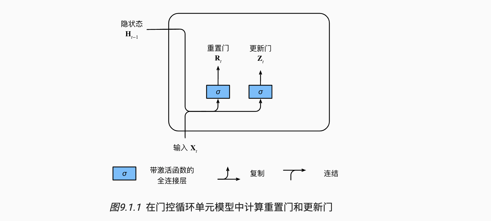
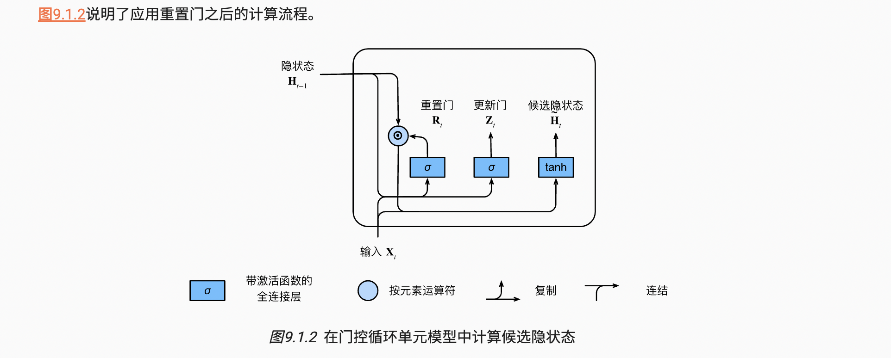
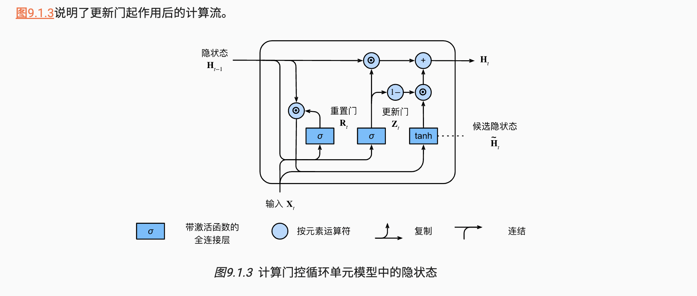
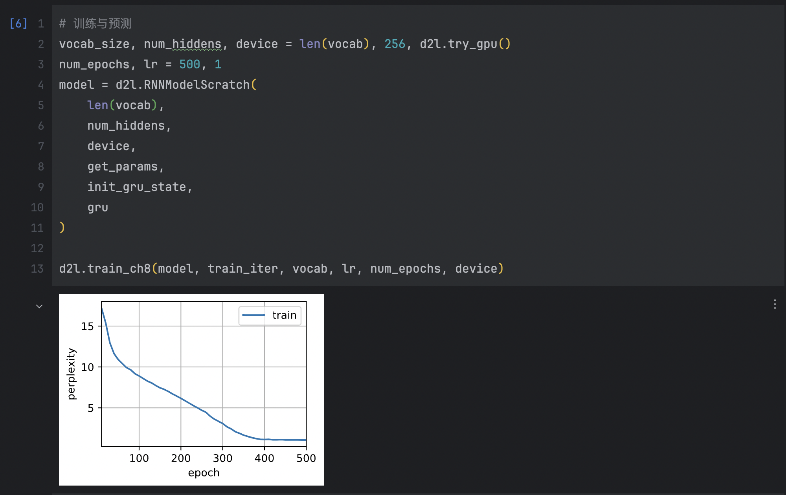
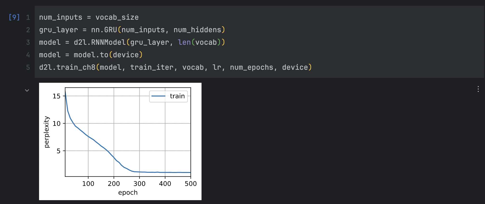

# 现代循环神经网络 GRU

主题：门控循环单元


## 1 门控隐状态

### 1. 重置门和更新门

- 更新门：能关注的机制

- 重置门：能遗忘的机制

我们把它们设计成`(0,1)`区间中的向量，重置门允许我们控制“可能还想记住”的过去状态的数量； 更新门将允许我们控制新状态中有多少个是旧状态的副本。

```python
- 输入: 
    是由当前时间步的输入和前一时间步的隐状态给出
- 两个门的输出:
    是由使用sigmoid激活函数的两个全连接层给出。
```



- 门控循环单元的数学表达

我们来看一下门控循环单元的数学表达。对于给定的时间步$t$，假设输入是一个小批量$\mathbf{X}_t \in \mathbb{R}^{n \times d}$（样本个数$n$，输入个数$d$），上一个时间步的隐状态是$\mathbf{H}_{t-1} \in \mathbb{R}^{n \times h}$（隐藏单元个数$h$）。那么，重置门$\mathbf{R}_t \in \mathbb{R}^{n \times h}$和更新门$\mathbf{Z}_t \in \mathbb{R}^{n \times h}$的计算如下所示：
$$
\begin{aligned}
\mathbf{R}_t = \sigma(\mathbf{X}_t \mathbf{W}_{xr} + \mathbf{H}_{t-1} \mathbf{W}_{hr} + \mathbf{b}_r),\\
\mathbf{Z}_t = \sigma(\mathbf{X}_t \mathbf{W}_{xz} + \mathbf{H}_{t-1} \mathbf{W}_{hz} + \mathbf{b}_z),
\end{aligned}
$$
其中$\mathbf{W}_{xr}, \mathbf{W}_{xz} \in \mathbb{R}^{d \times h}$和$\mathbf{W}_{hr}, \mathbf{W}_{hz} \in \mathbb{R}^{h \times h}$是权重参数，$\mathbf{b}_r, \mathbf{b}_z \in \mathbb{R}^{1 \times h}$是偏置参数。


### 2. 候选隐状态

接下来，让我们将重置门$\mathbf{R}_t$与常规隐状态更新机制集成，得到在时间步$t$的**候选隐状态**（candidate hidden state）$\tilde{\mathbf{H}}_t \in \mathbb{R}^{n \times h}$。
$$
\tilde{\mathbf{H}}_t = \tanh(\mathbf{X}_t \mathbf{W}_{xh} + \left(\mathbf{R}_t \odot \mathbf{H}_{t-1}\right) \mathbf{W}_{hh} + \mathbf{b}_h)
$$
其中$\mathbf{W}_{xh} \in \mathbb{R}^{d \times h}$和$\mathbf{W}_{hh} \in \mathbb{R}^{h \times h}$是权重参数，$\mathbf{b}_h \in \mathbb{R}^{1 \times h}$是偏置项，符号$\odot$是Hadamard积（按元素乘积）运算符。在这里，我们使用tanh非线性激活函数来确保候选隐状态中的值保持在区间$(-1, 1)$中。

$\mathbf{R}_t$和$\mathbf{H}_{t-1}$的元素相乘可以减少以往状态的影响。每当重置门$\mathbf{R}_t$中的项接近$1$时，我们恢复一个普通的循环神经网络。对于重置门$\mathbf{R}_t$中所有接近$0$的项(相乘相当于重置)，候选隐状态是以$\mathbf{X}_t$作为输入的多层感知机的结果。因此，任何预先存在的隐状态都会被**重置**为默认值。




### 3. 隐状态

这一步确定新的隐状态$\mathbf{H}_t \in \mathbb{R}^{n \times h}$在多大程度上来自旧的状态$\mathbf{H}_{t-1}$和新的候选状态$\tilde{\mathbf{H}}_t$。

更新门$\mathbf{Z}_t$仅需要在$\mathbf{H}_{t-1}$和$\tilde{\mathbf{H}}_t$之间进行按元素的凸组合就可以实现这个目标。这就得出了门控循环单元的最终更新公式：
$$
\mathbf{H}_t = \mathbf{Z}_t \odot \mathbf{H}_{t-1}  + (1 - \mathbf{Z}_t) \odot \tilde{\mathbf{H}}_t
$$
每当更新门$\mathbf{Z}_t$接近$1$时，模型就倾向只保留旧状态。此时，来自$\mathbf{X}_t$的信息基本上被忽略，从而有效地跳过了依赖链条中的时间步$t$。相反，当$\mathbf{Z}_t$接近$0$时，新的隐状态$\mathbf{H}_t$就会接近候选隐状态$\tilde{\mathbf{H}}_t$。这些设计可以帮助我们处理循环神经网络中的梯度消失问题，并更好地捕获时间步距离很长的序列的依赖关系。例如，如果整个子序列的所有时间步的更新门都接近于$1$，则无论序列的长度如何，在序列起始时间步的旧隐状态都将很容易保留并传递到序列结束。



总之，门控循环单元具有以下两个显著特征：

- 重置门有助于捕获序列中的短期依赖关系；
- 更新门有助于捕获序列中的长期依赖关系。


## 2 从零开始实现

```python
import torch
from torch import nn
from d2l import torch as d2l

# 加载数据
batch_size, num_steps = 32, 35
train_iter, vocab = d2l.load_data_time_machine(batch_size, num_steps)
```


### 1. 初始化模型参数

下一步是初始化模型参数。 我们从标准差为0.01的高斯分布中提取权重， 并将偏置项设为0，超参数`num_hiddens`定义隐藏单元的数量， 实例化与更新门、重置门、候选隐状态和输出层相关的所有权重和偏置。

```python
# 初始化模型参数
def get_params(vocab_size, num_hiddens, device):
    num_inputs = num_outputs = vocab_size

    def normal(shape):
        return torch.randn(size=shape, device=device) * 0.01

    # 方便更新门、重置门、候选隐状态参数的赋值
    def three():
        return (normal((num_inputs, num_hiddens)),
                normal((num_hiddens, num_hiddens)),
                torch.zeros(num_hiddens, device=device))

    W_xz, W_hz, b_z = three()  # 更新门参数
    W_xr, W_hr, b_r = three()  # 重置门参数
    W_xh, W_hh, b_h = three()  # 候选隐状态参数

    # 输出层参数
    W_hq = normal((num_hiddens, num_outputs))
    b_q = torch.zeros(num_outputs, device=device)

    # 附加梯度
    params = [W_xz, W_hz, b_z, W_xr, W_hr, b_r, W_xh, W_hh, b_h, W_hq, b_q]
    for param in params:
        param.requires_grad_(True)

    return params
```


### 2. 定义模型

现在我们将定义隐状态的初始化函数`init_gru_state`。 此函数返回一个形状为（批量大小，隐藏单元个数）的张量，张量的值全部为零。

```python
# 隐状态的初始化函数, 返回一个形状为（批量大小，隐藏单元个数）
def init_gru_state(batch_size, num_hiddens, device):
    return (torch.zeros((batch_size, num_hiddens), device=device),)
```

定义门控循环单元模型

```python
# 定义门控循环单元模型
def gru(inputs, state, params):
    W_xz, W_hz, b_z, W_xr, W_hr, b_r, W_xh, W_hh, b_h, W_hq, b_q = params  # 参数
    H, = state  # 初始隐状态
    outputs = []  # 输出

    for X in inputs:  # 每num_steps拿出一个输入X
        Z = torch.sigmoid((X @ W_xz) + (H @ W_hz) + b_z)  # 更新门  
        R = torch.sigmoid((X @ W_xr) + (H @ W_hr) + b_r)  # 重置门
        H_tilda = torch.tanh((X @ W_xh) + ((R * H) @ W_hh) + b_h)  # 候选隐状态
        H = Z * H + (1 - Z) * H_tilda  # 下一个状态
        Y = H @ W_hq + b_q  # 输出
        outputs.append(Y)
        # @ 按照矩阵乘法，* 按照元素相乘
        
    return torch.cat(outputs, dim=0), (H,)
```


### 3. 训练与预测

训练结束后，我们分别打印输出训练集的困惑度， 以及前缀“time traveler”和“traveler”的预测序列上的困惑度。

```python
# 训练与预测
vocab_size, num_hiddens, device = len(vocab), 256, d2l.try_gpu()
num_epochs, lr = 500, 1
model = d2l.RNNModelScratch(
    len(vocab),
    num_hiddens,
    device,
    get_params,
    init_gru_state,
    gru
)

d2l.train_ch8(model, train_iter, vocab, lr, num_epochs, device)
```




## 3 简洁实现

```python
num_inputs = vocab_size
gru_layer = nn.GRU(num_inputs, num_hiddens)
model = d2l.RNNModel(gru_layer, len(vocab))
model = model.to(device)
d2l.train_ch8(model, train_iter, vocab, lr, num_epochs, device)
```




