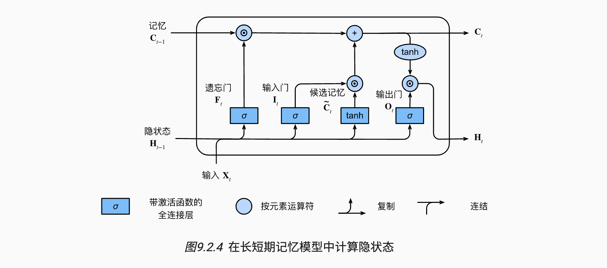

# 现代循环神经网络 LSTM

主题：长短期记忆网络


## 1 门控记忆元

**输出门**（output gate）：用来从单元中输出条目。

**输入门**（input gate）：用来决定何时将数据读入单元。

**遗忘门**（forget gate）：一种机制来重置单元的内容


### 1. 输入门、忘记门和输出门

- 忘记门：将值朝0减少
- 输入门：决定是不是忽略掉输入数据
- 输出门：决定是不是使用隐状态

类似的计算，假设有$h$个隐藏单元，批量大小为$n$，输入数为$d$。因此，输入为$\mathbf{X}_t \in \mathbb{R}^{n \times d}$，前一时间步的隐状态为$\mathbf{H}_{t-1} \in \mathbb{R}^{n \times h}$。相应地，时间步$t$的门被定义如下：输入门是$\mathbf{I}_t \in \mathbb{R}^{n \times h}$，遗忘门是$\mathbf{F}_t \in \mathbb{R}^{n \times h}$，输出门是$\mathbf{O}_t \in \mathbb{R}^{n \times h}$。它们的计算方法如下：
$$
\begin{aligned}
\mathbf{I}_t &= \sigma(\mathbf{X}_t \mathbf{W}_{xi} + \mathbf{H}_{t-1} \mathbf{W}_{hi} + \mathbf{b}_i),\\
\mathbf{F}_t &= \sigma(\mathbf{X}_t \mathbf{W}_{xf} + \mathbf{H}_{t-1} \mathbf{W}_{hf} + \mathbf{b}_f),\\
\mathbf{O}_t &= \sigma(\mathbf{X}_t \mathbf{W}_{xo} + \mathbf{H}_{t-1} \mathbf{W}_{ho} + \mathbf{b}_o),
\end{aligned}
$$
其中$\mathbf{W}*_{xi}, \mathbf{W}_*{xf}, \mathbf{W}_{xo} \in \mathbb{R}^{d \times h}$和$\mathbf{W}*_{hi}, \mathbf{W}_*{hf}, \mathbf{W}_{ho} \in \mathbb{R}^{h \times h}$是权重参数，$\mathbf{b}_i, \mathbf{b}_f, \mathbf{b}_o \in \mathbb{R}^{1 \times h}$是偏置参数。


### 2. 候选记忆元

**候选记忆元**（candidate memory cell）$\tilde{\mathbf{C}}_t \in \mathbb{R}^{n \times h}$。它的计算与上面描述的三个门的计算类似，但是使用$\tanh$函数作为激活函数，函数的值范围为$(-1, 1)$。下面导出在时间步$t$处的方程：
$$
\tilde{\mathbf{C}}_t = \text{tanh}(\mathbf{X}_t \mathbf{W}_{xc} + \mathbf{H}_{t-1} \mathbf{W}_{hc} + \mathbf{b}_c)
$$
其中$\mathbf{W}_{xc} \in \mathbb{R}^{d \times h}$和$\mathbf{W}_{hc} \in \mathbb{R}^{h \times h}$是权重参数，$\mathbf{b}_c \in \mathbb{R}^{1 \times h}$是偏置参数。


### 3. 记忆元

输入门$\mathbf{I}_t$控制采用多少来自$\tilde{\mathbf{C}}_t$的新数据，而遗忘门$\mathbf{F}_t$控制保留多少过去的记忆元$\mathbf{C}_{t-1} \in \mathbb{R}^{n \times h}$的内容。使用按元素乘法，得出：
$$
\mathbf{C}_t = \mathbf{F}_t \odot \mathbf{C}_{t-1} + \mathbf{I}_t \odot \tilde{\mathbf{C}}_t
$$
如果遗忘门始终为$1$且输入门始终为$0$，则过去的记忆元$\mathbf{C}_{t-1}$将随时间被保存并传递到当前时间步。引入这种设计是为了缓解梯度消失问题，并更好地捕获序列中的长距离依赖关系。


### 4. 隐状态

在长短期记忆网络中，它仅仅是记忆元的$\tanh$的门控版本。这就确保了$\mathbf{H}_t$的值始终在区间$(-1, 1)$内：
$$
\mathbf{H}_t = \mathbf{O}_t \odot \tanh(\mathbf{C}_t)
$$
只要输出门接近$1$，我们就能够有效地将所有记忆信息传递给预测部分，而对于输出门接近$0$，我们只保留记忆元内的所有信息，而不需要更新隐状态。




## 2 从零开始实现

首先加载数据集

```python
import torch
from torch import nn
from d2l import torch as d2l

batch_size, num_steps = 32, 35
train_iter, vocab = d2l.load_data_time_machine(batch_size, num_steps)
```


### 1. 初始化模型参数

超参数`num_hiddens`定义隐藏单元的数量。 我们按照标准差0.01的高斯分布初始化权重，并将偏置项设为0。

```python
# 初始化模型参数
def get_lstm_params(vocab_size, num_hiddens, device):
    num_inputs = num_outputs = vocab_size

    def normal(shape):
        return torch.randn(size=shape, device=device) * 0.01
    
    # 统一赋值，仅仅为了方便
    def three():
        return (normal((num_inputs, num_hiddens)),
                normal((num_hiddens, num_hiddens)),
                torch.zeros(num_hiddens, device=device))

    W_xi, W_hi, b_i = three()  # 输入门参数
    W_xf, W_hf, b_f = three()  # 遗忘门参数
    W_xo, W_ho, b_o = three()  # 输出门参数
    W_xc, W_hc, b_c = three()  # 候选记忆元参数
    
    # 输出层参数
    W_hq = normal((num_hiddens, num_outputs))
    b_q = torch.zeros(num_outputs, device=device)
    
    # 附加梯度
    params = [W_xi, W_hi, b_i, W_xf, W_hf, b_f, W_xo, W_ho, b_o, W_xc, W_hc, b_c, W_hq, b_q]
    for param in params:
        param.requires_grad_(True)
    return params
```


### 2. 定义模型

在初始化函数中，长短期记忆网络的隐状态需要返回一个**额外**的记忆元，即`H`和`C`，单元的值为0，形状为（批量大小，隐藏单元数）。因此，我们得到以下的状态初始化。

```python
# 初始化函数，初始H和C
def init_lstm_state(batch_size, num_hiddens, device):
    return (torch.zeros((batch_size, num_hiddens), device=device),
            torch.zeros((batch_size, num_hiddens), device=device))
```

实际模型的定义与我们前面讨论的一样： 提供三个门和一个额外的记忆元。 请注意，只有隐状态才会传递到输出层， 而记忆元$C_t$不直接参与输出计算。


### 3. 训练和预测

引入的`RNNModelScratch`类来训练一个长短期记忆网络。

```python
# 训练和预测
vocab_size, num_hiddens, device = len(vocab), 256, d2l.try_gpu()
num_epochs, lr = 500, 1
model = d2l.RNNModelScratch(len(vocab), num_hiddens, device, get_lstm_params, init_lstm_state, lstm)
d2l.train_ch8(model, train_iter, vocab, lr, num_epochs, device)
```


## 3 简洁实现

```python
# 简洁实现
num_inputs = vocab_size
lstm_layer = nn.LSTM(num_inputs, num_hiddens)
model = d2l.RNNModel(lstm_layer, len(vocab))
model = model.to(device)
d2l.train_ch8(model, train_iter, vocab, lr, num_epochs, device)
```


