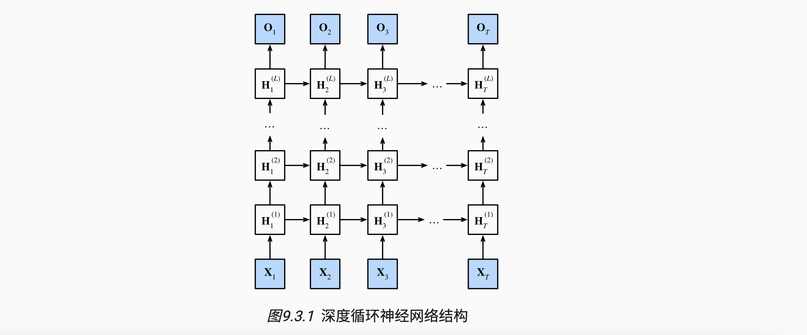
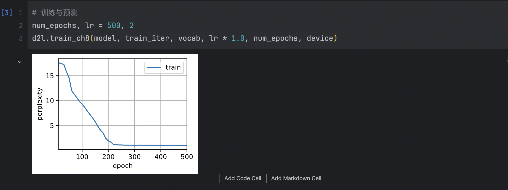
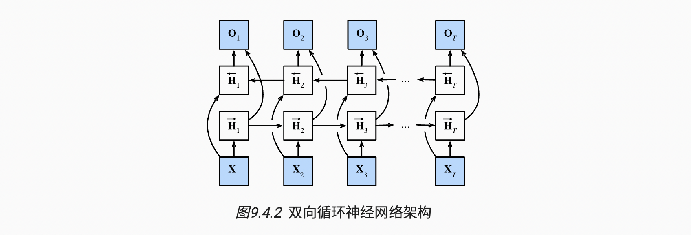
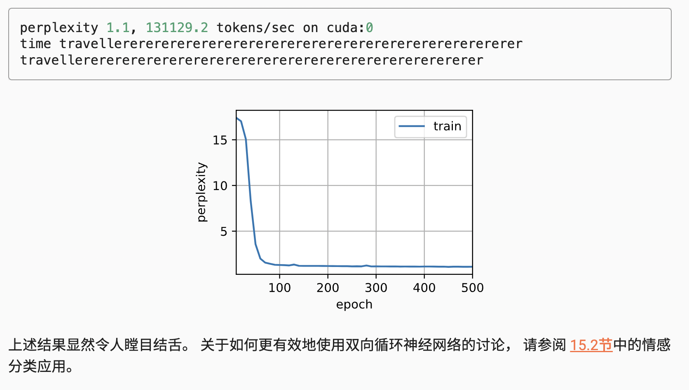

# 现代循环神经网络 DRNN BRNN

主题：深度循环神经网络、双向循环神经网络


## 1 深度循环神经网络

### 1. 网络结构

我们可以将多层循环神经网络堆叠在一起，下图描述了一个具有L个隐藏层的深度循环神经网络， 每个隐状态都连续地传递到当前层的下一个时间步和下一层的当前时间步。



> 简单来说，就是增加隐藏层实现更多的非线性性


### 2. 函数依赖关系

假设在时间步$t$有一个小批量的输入数据$\mathbf{X}_t \in \mathbb{R}^{n \times d}$（样本数：$n$，每个样本中的输入数：$d$）。同时，将$l^\mathrm{th}$隐藏层（$l=1,\ldots,L$）的隐状态设为$\mathbf{H}_t^{(l)}  \in \mathbb{R}^{n \times h}$（隐藏单元数：$h$），输出层变量设为$\mathbf{O}_t \in \mathbb{R}^{n \times q}$（输出数：$q$）。设置$\mathbf{H}_t^{(0)} = \mathbf{X}_t$，第$l$个隐藏层的隐状态使用激活函数$\phi_l$，则：
$$
\mathbf{H}_t^{(l)} = \phi_l(\mathbf{H}*_t^{(l-1)} \mathbf{W}_*{xh}^{(l)} + \mathbf{H}*_{t-1}^{(l)} \mathbf{W}_*{hh}^{(l)}  + \mathbf{b}_h^{(l)})
$$
其中，权重$\mathbf{W}_{xh}^{(l)} \in \mathbb{R}^{h \times h}$，$\mathbf{W}_{hh}^{(l)} \in \mathbb{R}^{h \times h}$和偏置$\mathbf{b}_h^{(l)} \in \mathbb{R}^{1 \times h}$都是第$l$个隐藏层的模型参数。最后，输出层的计算仅基于第$l$个隐藏层最终的隐状态：
$$
\mathbf{O}_t = \mathbf{H}*_t^{(L)} \mathbf{W}_*{hq} + \mathbf{b}_q
$$
其中，权重$\mathbf{W}_{hq} \in \mathbb{R}^{h \times q}$和偏置$\mathbf{b}_q \in \mathbb{R}^{1 \times q}$都是输出层的模型参数。

与多层感知机一样，隐藏层数目$L$和隐藏单元数目$h$都是超参数。也就是说，它们可以由我们调整的。另外，用门控循环单元或长短期记忆网络的隐状态来代替隐状态进行计算，可以很容易地得到深度门控循环神经网络或深度长短期记忆神经网络。


### 3. 简洁实现

```python
import torch
from torch import nn
from d2l import torch as d2l

# 导入数据
batch_size, num_steps = 32, 35
train_iter, vocab = d2l.load_data_time_machine(batch_size, num_steps)
```

```python
# 唯一的区别是，我们现在通过num_layers的值来设定隐藏层数。
vocab_size, num_hiddens, num_layers = len(vocab), 256, 2
num_inputs = vocab_size
device = d2l.try_gpu()
lstm_layer = nn.LSTM(num_inputs, num_hiddens, num_layers)
model = d2l.RNNModel(lstm_layer, len(vocab))
model = model.to(device)
```


### 4. 训练与预测

```python
# 训练与预测
num_epochs, lr = 500, 2
d2l.train_ch8(model, train_iter, vocab, lr * 1.0, num_epochs, device)
```




## 2 双向循环神经网络

“下文”传达了重要信息


### 1. 隐马尔可夫模型中的动态规划

https://zh-v2.d2l.ai/chapter_recurrent-modern/bi-rnn.html#id2


### 2. 双向模型

双向循环神经网络：

- 一个前向RNN隐层
- 一个反向RNN隐层
- 合并两个隐状态得到输出




#### - 定义

对于任意时间步$t$，给定一个小批量的输入数据$\mathbf{X}_t \in \mathbb{R}^{n \times d}$（样本数$n$，每个示例中的输入数$d$），并且令隐藏层激活函数为$\phi$。在双向架构中，我们设该时间步的前向和反向隐状态分别为$\overrightarrow{\mathbf{H}}_t  \in \mathbb{R}^{n \times h}$和$\overleftarrow{\mathbf{H}}_t  \in \mathbb{R}^{n \times h}$，其中$h$是隐藏单元的数目。前向和反向隐状态的更新如下：
$$
\begin{aligned}

\overrightarrow{\mathbf{H}}_t &= \phi(\mathbf{X}_t \mathbf{W}_{xh}^{(f)} + \overrightarrow{\mathbf{H}}_{t-1} \mathbf{W}_{hh}^{(f)}  + \mathbf{b}_h^{(f)}),\\

\overleftarrow{\mathbf{H}}_t &= \phi(\mathbf{X}_t \mathbf{W}_{xh}^{(b)} + \overleftarrow{\mathbf{H}}_{t+1} \mathbf{W}_{hh}^{(b)}  + \mathbf{b}_h^{(b)}),

\end{aligned}
$$
其中，权重$\mathbf{W}*_{xh}^{(f)} \in \mathbb{R}^{d \times h}, \mathbf{W}_*{hh}^{(f)} \in \mathbb{R}^{h \times h}, \mathbf{W}*_{xh}^{(b)} \in \mathbb{R}^{d \times h}, \mathbf{W}_*{hh}^{(b)} \in \mathbb{R}^{h \times h}$和偏置$\mathbf{b}_h^{(f)} \in \mathbb{R}^{1 \times h}$，$\mathbf{b}_h^{(b)} \in \mathbb{R}^{1 \times h}$都是模型参数。

接下来，将前向隐状态$\overrightarrow{\mathbf{H}}_t$和反向隐状态$\overleftarrow{\mathbf{H}}_t$连接起来，获得需要送入输出层的隐状态$\mathbf{H}_t \in \mathbb{R}^{n \times 2h}$。在具有多个隐藏层的深度双向循环神经网络中，该信息作为输入传递到下一个双向层。最后，输出层计算得到的输出为$\mathbf{O}_t \in \mathbb{R}^{n \times q}$（$q$是输出单元的数目）：
$$
\mathbf{O}_t = \mathbf{H}_t \mathbf{W}_{hq} + \mathbf{b}_q
$$
这里，权重矩阵$\mathbf{W}_{hq} \in \mathbb{R}^{2h \times q}$和偏置$\mathbf{b}_q \in \mathbb{R}^{1 \times q}$是输出层的模型参数。事实上，这两个方向可以拥有不同数量的隐藏单元。


#### - 模型的计算代价及其应用

- 双向循环神经网络的一个关键特性是：使用来自序列两端的信息来估计输出。

- 也就是说，我们使用来自过去和未来的观测信息来预测当前的观测。 

- 但是在对下一个词元进行预测的情况中，这样的模型并不是我们所需的。
- 双向层的使用在实践中非常少，并且仅仅应用于部分场合。 例如，填充缺失的单词、词元注释（例如，用于命名实体识别） 以及作为序列处理流水线中的一个步骤对序列进行编码（例如，用于机器翻译）。


### 3. 双向循环神经网络的`错误`应用

由于双向循环神经网络使用了过去的和未来的数据， 所以我们不能盲目地将这一语言模型应用于任何预测任务。 尽管模型产出的困惑度是合理的， 该模型预测未来词元的能力却可能存在严重缺陷。 我们用下面的示例代码引以为戒，以防在错误的环境中使用它们。

```python
import torch
from torch import nn
from d2l import torch as d2l

# 加载数据
batch_size, num_steps, device = 32, 35, d2l.try_gpu()
train_iter, vocab = d2l.load_data_time_machine(batch_size, num_steps)
# 通过设置“bidirective=True”来定义双向LSTM模型
vocab_size, num_hiddens, num_layers = len(vocab), 256, 2
num_inputs = vocab_size
lstm_layer = nn.LSTM(num_inputs, num_hiddens, num_layers, bidirectional=True)
model = d2l.RNNModel(lstm_layer, len(vocab))
model = model.to(device)
# 训练模型
num_epochs, lr = 500, 1
d2l.train_ch8(model, train_iter, vocab, lr, num_epochs, device)
```




