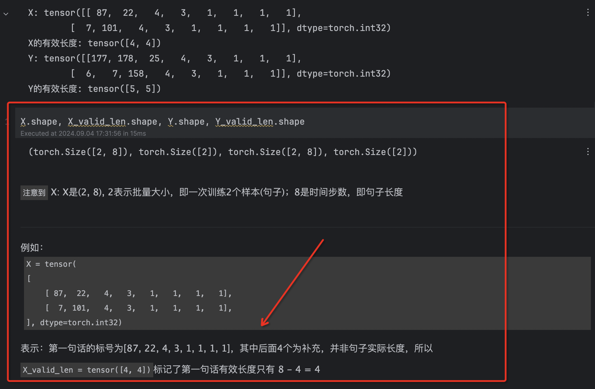

# 机器翻译数据集 解码器和编码器

主题：机器翻译数据集 解码器和编码器


## 1 机器翻译与数据集

### 1. 下载和预处理数据集

```python
import os
import torch
from d2l import torch as d2l
```

```python
data_dir = './fra-eng_dataset'


def read_data_nmt():
    """载入“英语－法语”数据集"""
    with open(os.path.join(data_dir, 'fra.txt'), 'r', encoding='utf-8') as f:
        return f.read()


raw_text = read_data_nmt()
print(raw_text[:75])
```

```python
# 我们用空格代替不间断空格（non-breaking space）， 使用小写字母替换大写字母，并在单词和标点符号之间插入空格。
def preprocess_nmt(text):
    """预处理“英语－法语”数据集"""

    def no_space(char, prev_char):
        return char in set(',.!?') and prev_char != ' '

    # 使用空格替换不间断空格
    # 使用小写字母替换大写字母
    text = text.replace('\u202f', ' ').replace('\xa0', ' ').lower()
    # 在单词和标点符号之间插入空格
    out = [' ' + char if i > 0 and no_space(char, text[i - 1]) else char for i, char in enumerate(text)]
    return ''.join(out)


text = preprocess_nmt(raw_text)
print(text[:80])
```


### 2. 词元化

```python
#@save
def tokenize_nmt(text, num_examples=None):
    """词元化“英语－法语”数据数据集"""
    source, target = [], []
    for i, line in enumerate(text.split('\n')):
        if num_examples and i > num_examples:
            break
        parts = line.split('\t')
        if len(parts) == 2:
            source.append(parts[0].split(' '))
            target.append(parts[1].split(' '))
    return source, target


source, target = tokenize_nmt(text)
source[:6], target[:6]
```


### 3. 词汇表

```python
# 构造词汇表，对于出现频率 < min_freg(2) 的次丢弃
src_vocab = d2l.Vocab(source, min_freq=2, reserved_tokens=['<pad>', '<bos>', '<eos>'])
len(src_vocab)
```


### 4. 加载数据集

```python
# 设定相同的长度num_steps，如果文本序列的词元数目少于num_steps时，在其末尾添加特定的“<pad>”词元，直到长度达到num_steps
# 反之，截断文本序列，只取其前num_steps个词元，并且丢弃剩余的词元
def truncate_pad(line, num_steps, padding_token):
    """截断或填充文本序列"""
    if len(line) > num_steps:
        return line[:num_steps]  # 截断
    return line + [padding_token] * (num_steps - len(line))  # 填充


truncate_pad(src_vocab[source[0]], 10, src_vocab['<pad>'])
# 这里长度只有2，前两个对应标号[47, 4]，其他用标号[1]即'<pad>'填充
```

```python
def build_array_nmt(lines, vocab, num_steps):
    """将机器翻译的文本序列转换成长度为num_steps的新句子"""
    lines = [vocab[l] for l in lines]
    lines = [l + [vocab['<eos>']] for l in lines]  # <eos> end of sentence 标记句子结尾
    array = torch.tensor([truncate_pad(l, num_steps, vocab['<pad>']) for l in lines])
    valid_len = (array != vocab['<pad>']).type(torch.int32).sum(1)  # 保存每句话实际有效的长度，排除填充的<pad>
    return array, valid_len
```


### 5. [封装]返回数据集的迭代器和词汇表

```python
#@save
def load_data_nmt(batch_size, num_steps, num_examples=600):
    """返回翻译数据集的迭代器和词表"""
    # 1. 下载数据集并预处理(针对标点符号)
    text = preprocess_nmt(read_data_nmt())
    
    # 2. 词元化，返回原始数据和目标数据
    source, target = tokenize_nmt(text, num_examples)
    
    # 3. 词汇表
    src_vocab = d2l.Vocab(source, min_freq=2, reserved_tokens=['<pad>', '<bos>', '<eos>'])
    tgt_vocab = d2l.Vocab(target, min_freq=2, reserved_tokens=['<pad>', '<bos>', '<eos>'])
    
    # 4. 将机器翻译的文本序列转换成长度为num_steps的新句子
    src_array, src_valid_len = build_array_nmt(source, src_vocab, num_steps)
    tgt_array, tgt_valid_len = build_array_nmt(target, tgt_vocab, num_steps)
    
    # 5. 构造数据迭代器
    data_arrays = (src_array, src_valid_len, tgt_array, tgt_valid_len)
    data_iter = d2l.load_array(data_arrays, batch_size)
    
    return data_iter, src_vocab, tgt_vocab
```


### 6. 测试

```python
train_iter, src_vocab, tgt_vocab = load_data_nmt(batch_size=2, num_steps=8)
for X, X_valid_len, Y, Y_valid_len in train_iter:
    print('X:', X.type(torch.int32))
    print('X的有效长度:', X_valid_len)
    print('Y:', Y.type(torch.int32))
    print('Y的有效长度:', Y_valid_len)
    break
```




## 2 编码器-解码器架构

设计一个包含两个主要组件的架构： 

- 第一个组件是一个*编码器*（encoder）： 它接受一个长度可变的序列作为输入， 并将其转换为具有固定形状的编码状态。 

- 第二个组件是*解码器*（decoder）： 它将固定形状的编码状态映射到长度可变的序列。 

这被称为*编码器-解码器*（encoder-decoder）架构


### 1. 编码器

在编码器接口中，我们只指定长度可变的序列作为编码器的输入`X`。 任何继承这个`Encoder`基类的模型将完成代码实现。

```python
class Encoder(nn.Module):
    """编码器-解码器架构的基本 '编码器 encoder' 接口"""

    def __init__(self, **kwargs):
        super(Encoder, self).__init__(**kwargs)

    def forward(self, X, *args):
        raise NotImplementedError
```


### 2. 解码器

在解码器接口中，新增一个`init_state`函数， 用于将编码器的输出（`enc_outputs`）转换为编码后的状态。 注意，此步骤可能需要额外的输入，例如：输入序列的有效长度。 为了逐个地生成长度可变的词元序列， 解码器在每个时间步都会将输入 （例如：在前一时间步生成的词元）和编码后的状态映射成当前时间步的输出词元。

```python
class Decoder(nn.Module):
    """编码器-解码器架构的基本 '解码器 decoder' 接口"""

    def __init__(self, **kwargs):
        super(Decoder, self).__init__(**kwargs)

    def init_state(self, enc_outputs, *args):
        # enc_outputs 是 encoder的输出
        raise NotImplementedError

    def forward(self, X, state):
        raise NotImplementedError
```


### 3. 合并编码器和解码器

- “编码器-解码器”架构包含了一个编码器和一个解码器， 并且还拥有可选的额外的参数。 

- 在前向传播中，编码器的输出用于生成编码状态， 这个状态又被解码器作为其输入的一部分。

```python
class EncoderDecoder(nn.Module):
    """编码器-解码器架构的基类 'encoder-decoder' """

    def __init__(self, encoder, decoder, **kwargs):
        super(EncoderDecoder, self).__init__(**kwargs)
        self.encoder = encoder
        self.decoder = decoder

    def forward(self, enc_X, dec_X, *args):
        enc_outputs = self.encoder(enc_X, *args)
        dec_state = self.decoder.init_state(enc_outputs, *args)
        return self.decoder(dec_X, dec_state)
```


