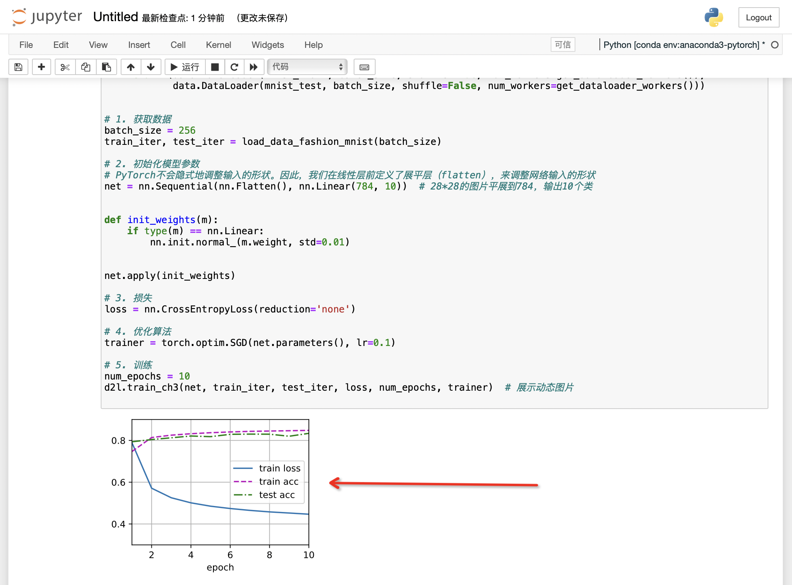

# 线性神经网络


## 1 线性回归


### 1.1 线性回归

- linear_regression

```python
import random
import torch


# 1. 生成数据集
def synthetic_data(w, b, num_examples):  # @save
    """ 生成y=Xw+b+噪声 """
    X = torch.normal(0, 1, (num_examples, len(w)))
    y = torch.matmul(X, w) + b
    y += torch.normal(0, 0.01, y.shape)
    return X, y.reshape((-1, 1))


"""真实数据"""
true_w = torch.tensor([2, -3.4])
true_b = 4.2
features, labels = synthetic_data(true_w, true_b, 1000)


# 2. 读取数据集
def data_iter(batch_size, features, labels):
    num_examples = len(features)
    indices = list(range(num_examples))
    # 这些样本是随机读取的，没有特定的顺序
    random.shuffle(indices)
    for i in range(0, num_examples, batch_size):
        batch_indices = torch.tensor(
            indices[i: min(i + batch_size, num_examples)])
        yield features[batch_indices], labels[batch_indices]


# 3. 初始化模型参数
w = torch.normal(0, 0.01, size=(2, 1), requires_grad=True)
b = torch.zeros(1, requires_grad=True)


# 4. 定义模型
def linreg(X, w, b):  # @save
    """线性回归模型"""
    return torch.matmul(X, w) + b


# 4. 定义损失函数
def squared_loss(y_hat, y):  # @save
    """均方损失"""
    return (y_hat - y.reshape(y_hat.shape)) ** 2 / 2


# 4. 定义优化算法
def sgd(params, lr, batch_size):  # @save
    """小批量随机梯度下降"""
    with torch.no_grad():
        for param in params:
            param -= lr * param.grad / batch_size
            param.grad.zero_()


# 5. 训练
lr = 0.03  # 学习率
num_epochs = 5  # 训练次数
net = linreg
loss = squared_loss
batch_size = 10

for epoch in range(num_epochs):
    for X, y in data_iter(batch_size, features, labels):
        l = loss(net(X, w, b), y)  # X和y的小批量损失
        # 因为l形状是(batch_size,1)，而不是一个标量。l中的所有元素被加到一起，
        # 并以此计算关于[w,b]的梯度
        l.sum().backward()
        sgd([w, b], lr, batch_size)  # 使用参数的梯度更新参数
    with torch.no_grad():
        train_l = loss(net(features, w, b), labels)
        print(f'epoch {epoch + 1}, loss {float(train_l.mean()):f}')

print(f'w的估计误差: {true_w - w.reshape(true_w.shape)}')
print(f'b的估计误差: {true_b - b}')
```


### 1.2 线性回归简洁

- linear_regression_concise

```python
import numpy as np
import torch
from torch.utils import data
from d2l import torch as d2l
from torch import nn

# 已包装进d2l的库里
# def synthetic_data(w, b, num_examples):
#     """ 生成y=Xw+b+噪声 """
#     X = torch.normal(0, 1, (num_examples, len(w)))
#     y = torch.matmul(X, w) + b
#     y += torch.normal(0, 0.01, y.shape)
#     return X, y.reshape((-1, 1))

# 1. 生成数据集
true_w = torch.tensor([2, -3.4])
true_b = 4.2
features, labels = d2l.synthetic_data(true_w, true_b, 1000)


# 2. 读取数据集
def load_array(data_arrays, batch_size, is_train=True):
    """构造一个PyTorch数据迭代器"""
    dataset = data.TensorDataset(*data_arrays)
    return data.DataLoader(dataset, batch_size, shuffle=is_train)


# 3. 定义模型
# nn是神经网络的缩写
net = nn.Sequential(nn.Linear(2, 1))

# 4. 初始化模型参数
net[0].weight.data.normal_(0, 0.01)
net[0].bias.data.fill_(0)

# 5. 定义损失函数
loss = nn.MSELoss()

# 6. 定义优化算法
trainer = torch.optim.SGD(net.parameters(), lr=0.03)

# 7. 训练
batch_size = 10
data_iter = load_array((features, labels), batch_size)  # 返回dataloader类型

num_epochs = 3
for epoch in range(num_epochs):
    for X, y in data_iter:
        l = loss(net(X), y)
        trainer.zero_grad()
        l.backward()
        trainer.step()
    l = loss(net(features), labels)
    print(f'epoch {epoch + 1}, loss {l:f}')

w = net[0].weight.data
print('w的估计误差：', true_w - w.reshape(true_w.shape))
b = net[0].bias.data
print('b的估计误差：', true_b - b)
```


## 2 Softmax回归 (分类问题)

### 1.1 Softmax

```python
"""重要"""
import torch
import torchvision
from torch import nn
from torch.utils import data
from torchvision import transforms
from d2l import torch as d2l

def get_dataloader_workers():
    """使用4个进程来读取数据"""
    return 4

def load_data_fashion_mnist(batch_size, resize=None):
    """下载Fashion-MNIST数据集，然后将其加载到内存中"""
    trans = [transforms.ToTensor(), ]
    # 如果图片过大，需要resize可以在这个函数里设定是否resize
    if resize:
        trans.insert(0, transforms.Resize(resize))
    trans = transforms.Compose(trans)
    mnist_train = torchvision.datasets.FashionMNIST(root="./data", train=True, transform=trans, download=False)
    mnist_test = torchvision.datasets.FashionMNIST(root="./data", train=False, transform=trans, download=False)
    return (data.DataLoader(mnist_train, batch_size, shuffle=True, num_workers=get_dataloader_workers()),
            data.DataLoader(mnist_test, batch_size, shuffle=False, num_workers=get_dataloader_workers()))

# 1. 获取数据
batch_size = 256
train_iter, test_iter = load_data_fashion_mnist(batch_size)

# 2. 初始化模型参数
# PyTorch不会隐式地调整输入的形状。因此，我们在线性层前定义了展平层（flatten），来调整网络输入的形状
net = nn.Sequential(nn.Flatten(), nn.Linear(784, 10))  # 28*28的图片平展到784，输出10个类

def init_weights(m):
    if type(m) == nn.Linear:
        nn.init.normal_(m.weight, std=0.01)

net.apply(init_weights)

# 3. 损失
loss = nn.CrossEntropyLoss(reduction='none')

# 4. 优化算法
trainer = torch.optim.SGD(net.parameters(), lr=0.1)

# 5. 训练
num_epochs = 10
d2l.train_ch3(net, train_iter, test_iter, loss, num_epochs, trainer)  # 展示动态图片
```




