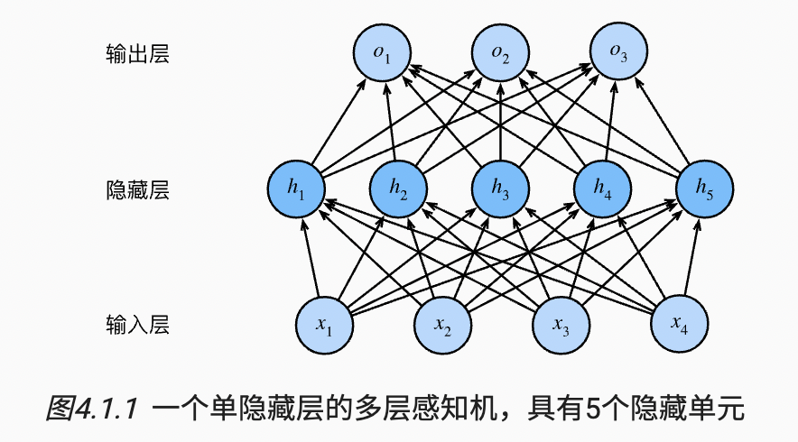
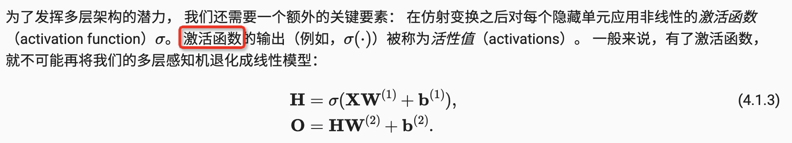
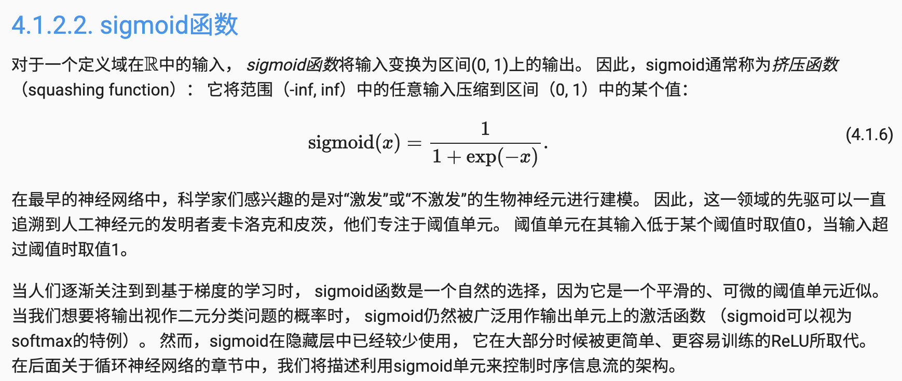
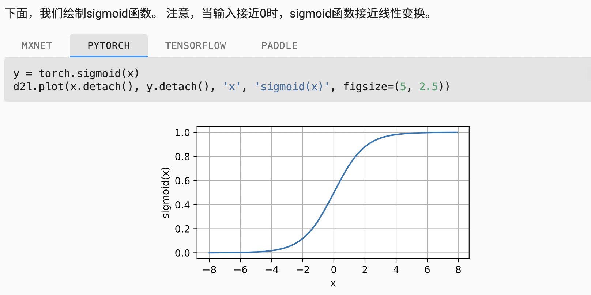
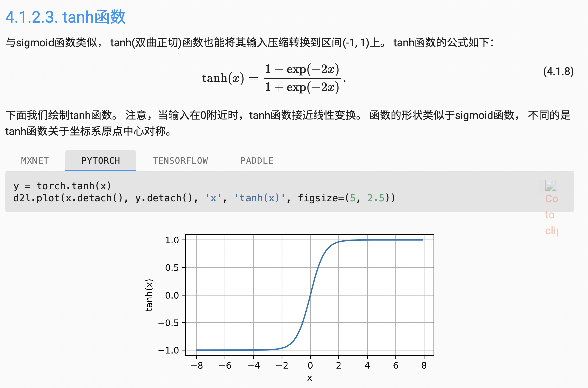
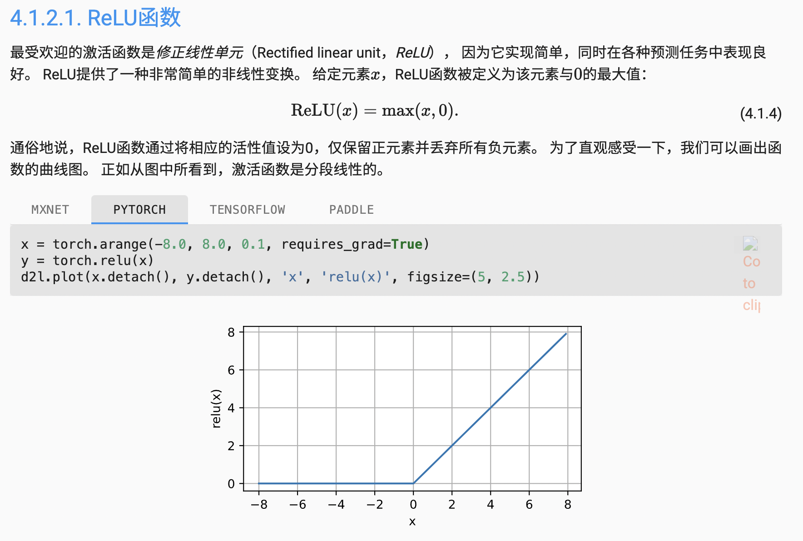
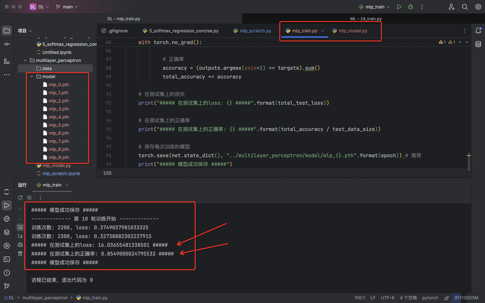

# 多层感知机


## 1 感知机

- 给定输入x，权重w，和偏移b，感知机输出：（类似二分类）

```python
o = sigma(<w, x> + b)
sigma(x) = 1, if x >0
sigma(x) = 0, otherwise

# 或者
sigma(x) = 1,  if x >0
sigma(x) = -1, otherwise
```


总结：

1. 感知机是一个二分类模型，是最早的AI模型之一
2. 求解算法等价于使用批量大小为1的梯度下降
3. 感知机不能拟合XOR函数，它只能产生线性分割面


## 2 多层感知机

### 2.1 多层感知机

我们可以通过在网络中加入一个或多个隐藏层来克服线性模型的限制， 使其能处理更普遍的函数关系类型。 要做到这一点，最简单的方法是将许多全连接层堆叠在一起。 每一层都输出到上面的层，直到生成最后的输出。 我们可以把前L−1层看作表示，把最后一层看作线性预测器。 这种架构通常称为多层感知机（multilayer perceptron），通常缩写为MLP。




### 2.2 激活函数



> H：隐藏层输出
>
> O：最终输出


#### Sigmoid函数





#### Tanh函数




#### ReLU函数



### 2.3 Softmax回归

```python
y1, y2, ..., yk = softmax(o1, o2, ..., ok)
```

- softmax回归：输入x，回归输出一个k维向量，使近似与概率，k分类问题
- 多层感知机：类似softmax回归，但多了隐藏层


## 3 代码实现

```python
import torch
import torchvision
from torch import nn
from torch.utils.data import DataLoader

from d2l import torch as d2l

# 1. 加载数据
train_iter = torchvision.datasets.FashionMNIST(
    root="../data",
    train=True,
    transform=torchvision.transforms.ToTensor(),
    download=True,
)

test_iter = torchvision.datasets.FashionMNIST(
    root="../data",
    train=False,
    transform=torchvision.transforms.ToTensor(),
    download=True,
)

# 2. 利用DataLoader加载数据集
batch_size = 256
dataloader_workers = 4
train_iter = DataLoader(train_iter, batch_size, shuffle=True, num_workers=dataloader_workers)
test_iter = DataLoader(test_iter, batch_size, shuffle=False, num_workers=dataloader_workers)

# 3. 搭建隐藏层：只有一层隐藏层，包含256个隐藏单元
num_inputs, num_outputs, num_hiddens = 28 * 28, 10, 256
W1 = nn.Parameter(torch.randn(num_inputs, num_hiddens, requires_grad=True))  # 第一层weight
b1 = nn.Parameter(torch.zeros(num_hiddens, requires_grad=True))  # 第一层bias
W2 = nn.Parameter(torch.randn(num_hiddens, num_outputs, requires_grad=True))  # 第二层/输出层weight
b2 = nn.Parameter(torch.zeros(num_outputs, requires_grad=True))  # 第二层/输出层bias
params = [W1, b1, W2, b2]


# 4. ReLU激活函数，自己定义
def relu(x):
    a = torch.zeros_like(x)
    return torch.max(x, a)


# 5. 完全手搭模型nn
def net(X):
    X = X.reshape((-1, num_inputs))
    H = relu(X @ W1 + b1)  # @ <=> dot
    return (H @ W2 + b2)


# 6. 损失函数
loss = nn.CrossEntropyLoss(reduction='none')

# 7. 开始训练
num_epochs, lr = 10, 0.1
updater = torch.optim.SGD(params, lr=lr)  # 优化器
d2l.train_ch3(net, train_iter, test_iter, loss, num_epochs, updater)  # 仅仅用于画图
```


## 4 代码实现(简洁)【推荐】

```python
import torch
import torchvision
from torch.utils.data import DataLoader

from mlp_model import *

# 1. 加载数据
train_iter = torchvision.datasets.FashionMNIST(
    root="../data",
    train=True,
    transform=torchvision.transforms.ToTensor(),
    download=True,
)

test_iter = torchvision.datasets.FashionMNIST(
    root="../data",
    train=False,
    transform=torchvision.transforms.ToTensor(),
    download=True,
)

# 2. 获取数据集长度
train_data_size = len(train_iter)
test_data_size = len(test_iter)

# 3. 利用DataLoader加载数据集
batch_size = 256
train_iter = DataLoader(train_iter, batch_size, shuffle=True)
test_iter = DataLoader(test_iter, batch_size, shuffle=False)

# 4. 利用pytorch搭建神经网络 [搭建隐藏层：只有一层隐藏层，包含256个隐藏单元]
net = net()

# 5. 损失函数
loss_fn = nn.CrossEntropyLoss()

# 6. 优化器
learning_rate = 0.1
optimizer = torch.optim.SGD(
    params=net.parameters(),
    lr=learning_rate,
)

# 7. 设置训练网络的参数
total_train_step = 0  # 训练次数
total_test_step = 0  # 测试次数 == epoch
epochs = 10  # 训练迭代次数

# 8. 开始训练
for epoch in range(epochs):
    print("------------- 第 {} 轮训练开始 -------------".format(epoch))

    # 训练步骤
    net.train()
    for data in train_iter:
        # 输入输出
        images, targets = data
        outputs = net(images)

        # 损失函数
        loss = loss_fn(outputs, targets)

        # 清零梯度
        optimizer.zero_grad()

        # 反向传播
        loss.backward()

        # 更新参数
        optimizer.step()

        total_train_step += 1
        if total_train_step % 100 == 0:
            print("训练次数: {}, loss: {}".format(total_train_step, loss.item()))

    # 测试步骤(不更新参数)
    net.eval()
    total_test_loss = 0  # 测试集损失累积
    total_accuracy = 0  # 分类问题正确率
    with torch.no_grad():
        for data in test_iter:
            images, targets = data
            outputs = net(images)
            loss = loss_fn(outputs, targets)
            total_test_loss += loss.item()

            # 正确率
            accuracy = (outputs.argmax(axis=1) == targets).sum()
            total_accuracy += accuracy

    # 在测试集上的损失
    print("##### 在测试集上的loss: {} #####".format(total_test_loss))

    # 在测试集上的正确率
    print("##### 在测试集上的正确率: {} #####".format(total_accuracy / test_data_size))

    # 保存每次训练的模型
    torch.save(net.state_dict(), "../multilayer_perceptron/model/mlp_{}.pth".format(epoch)) # 推荐
    print("##### 模型成功保存 #####")
```



