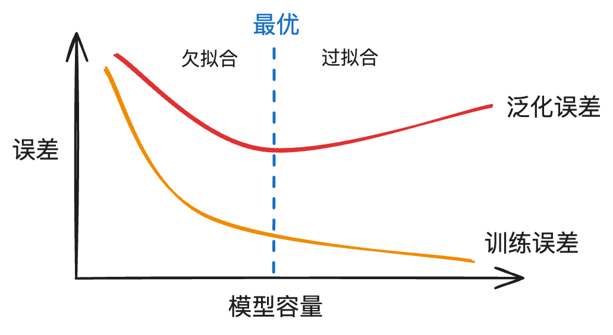

# 模型选择 & 过拟合和欠拟合

主题：模型选择、过拟合、欠拟合、过拟合的处理（权重衰退、丢弃法Dropout）、数值稳定性和模型初始化


## 1 模型选择

### 1. 训练误差和泛化误差

- 训练误差：模型在训练数据上的误差
- 泛化误差：模型在新数据上的误差


### 2. 验证数据集和测试训练集

- 验证数据集：一个用来评估模型好坏的数据集（validation）
    - 例如拿出50%的训练数据来验证
    - 不要和训练数据集混在一起

- 测试数据集：只用一次的数据集（test）
    - 未来的数据
    - 只能用来测试一次，不可以拿来学习、训练、调参等


### 3. K-折交叉验证

```python
K-折交叉验证 -> 调超参数
设置不同的超参数，通过K-折交叉验证，选择最好的超参数，然后
	1. 利用这些超参数，重新在整个训练数据集上重新训练
    2. 或者在目前的K个模型里任意挑选一个
    3. 目前的K个全部保留，以后测试时，分别输入到这K个模型里，得到结果后取均值
```

- 常见情况：没有足够多的数据使用

- 算法：

    1. 将训练数据分割成K块

    2. for i = 1, 2, ..., K

        ​	使用第i块作为验证数据集，其余作为训练数据集

    3. 报告K个验证集误差的平均

- 常用：K=5或10


### 4. 总结

```python
- 训练数据集：训练模型参数
- 验证数据集：训练模型超参数
- 非大数据集上通常使用K-折交叉验证
```

#### - 参数(parameter)

> 模型本身的参数，不是人为设置的，而是机器学习得来的，例如权重和偏倚等


#### - 超参数(Hyperparameter)

> 是在开始学习过程之前设置值的参数，需要人为设置，例如学习率、正则化系数、隐藏层层数(深度)、激活函数等


## 2 过拟合和欠拟合

### 1. 过拟合和欠拟合


### 2. 模型容量

#### - 定义

- 拟合各种函数的能力
- 低容量的模型难以拟合训练数据
- 高容量的模型可以记住所有的训练数据




#### - 估计模型容量

- 难以在不同种类的算法直接比较
    - 例如树和神经网络
- 给定一个模型种类，将有2个主要因素
    - 参数个数
    - 参数值的选择范围


#### - VC维

1. 定义：对于一个分类模型，VC等于一个最大的数据集大小，满足无论如何给标号，都存在一个模型对它进行完美分类
2. 例子：2维输入的感知机(in_features=2, out_features=1)的VC维=3

能够分类任意的三个点，但不是4个(XOR)

3. 例子：支持N维输入的感知机的VC维=N+1


### 3. 数据复杂度

#### - 多个重要因素

- 样本个数
- 每个样本的元素个数
- 时间、空间结构
- 多样性


## 3 代码实现

```python
import math
import numpy as np
import torch
from torch import nn
from d2l import torch as d2l
```

```python
# 生成多项式
max_degree = 20  # 多项式的最大阶数
n_train, n_test = 100, 100  # 训练和测试数据集大小，注意这里的n_test实际上是n_valid
true_w = np.zeros(max_degree)  # 分配大量的空间
true_w[0:4] = np.array([5, 1.2, -3.4, 5.6])

# 噪音
features = np.random.normal(size=(n_train + n_test, 1))
np.random.shuffle(features)
poly_features = np.power(features, np.arange(max_degree).reshape(1, -1))
for i in range(max_degree):
    poly_features[:, i] /= math.gamma(i + 1)  # gamma(n)=(n-1)!
# labels的维度:(n_train+n_test,)
labels = np.dot(poly_features, true_w)
labels += np.random.normal(scale=0.1, size=labels.shape)
```

```python
# NumPy ndarray转换为tensor
true_w, features, poly_features, labels = [
    torch.tensor(x, dtype=torch.float32) for x in [true_w, features, poly_features, labels]
]

features[:2], poly_features[:2, :], labels[:2]
```

```python
def evaluate_loss(net, data_iter, loss):
    """评估给定数据集上模型的损失"""
    metric = d2l.Accumulator(2)  # 损失的总和,样本数量
    for X, y in data_iter:
        out = net(X)
        y = y.reshape(out.shape)
        l = loss(out, y)
        metric.add(l.sum(), l.numel())
    return metric[0] / metric[1]
```

```python
def train(train_features, test_features, train_labels, test_labels,
          num_epochs=400):
    loss = nn.MSELoss(reduction='none')
    input_shape = train_features.shape[-1]
    # 不设置偏置，因为我们已经在多项式中实现了它
    net = nn.Sequential(nn.Linear(input_shape, 1, bias=False))
    batch_size = min(10, train_labels.shape[0])
    train_iter = d2l.load_array((train_features, train_labels.reshape(-1, 1)),
                                batch_size)
    test_iter = d2l.load_array((test_features, test_labels.reshape(-1, 1)),
                               batch_size, is_train=False)
    trainer = torch.optim.SGD(net.parameters(), lr=0.01)
    animator = d2l.Animator(xlabel='epoch', ylabel='loss', yscale='log',
                            xlim=[1, num_epochs], ylim=[1e-3, 1e2],
                            legend=['train', 'test'])
    for epoch in range(num_epochs):
        d2l.train_epoch_ch3(net, train_iter, loss, trainer)
        if epoch == 0 or (epoch + 1) % 20 == 0:
            animator.add(epoch + 1, (evaluate_loss(net, train_iter, loss),
                                     evaluate_loss(net, test_iter, loss)))
    print('weight:', net[0].weight.data.numpy())
```

三阶多项式函数拟合(正常)

```python
# 从多项式特征中选择前4个维度，即1,x,x^2/2!,x^3/3!
train(poly_features[:n_train, :4], poly_features[n_train:, :4], labels[:n_train], labels[n_train:])
```

线性函数拟合(欠拟合)

```python
# 从多项式特征中选择前2个维度，即1和x
train(poly_features[:n_train, :2], poly_features[n_train:, :2], labels[:n_train], labels[n_train:])
```

高阶多项式函数拟合(过拟合)

```python
# 从多项式特征中选取所有维度
train(poly_features[:n_train, :], poly_features[n_train:, :], labels[:n_train], labels[n_train:], num_epochs=1500)
```


## 4 权重衰退

处理``过拟合``现象，在损失函数里加上罚函数

https://zh-v2.d2l.ai/chapter_multilayer-perceptrons/weight-decay.html

pytorch提供了正则化的简单方法

```python
损失函数SGD的参数 weight_decay=0
```


## 5 丢弃法(暂退法Dropout)

处理``过拟合``现象

https://zh-v2.d2l.ai/chapter_multilayer-perceptrons/dropout.html

### 1. 定义

丢弃法对隐藏层加入噪音，防止过拟合


> 即随机把hidden layer输出变成0，但保证期望不变


### 2. 训练时

- 通常将丢弃法作用在隐藏层的输出上

```python
h = sigma(W1 @ x + b1)  # 第一层
h_ = dropout(h)  ''' 丢弃法加入噪音 '''
o = W2 @ h_ + b2  # 第二层(输出层)
y = softmax(o)
```


### 3. 测试时

正则项只在训练时使用，预测时返回hidden layer


### 4. 总结

- 丢弃法将一些输出项随机置0来控制模型复杂度
- 常作用在**``多层感知机MLP``**的隐藏层的输出上
- 丢弃概率是控制控制模型复杂度的**``超参数``**


### 5. 代码实现

``nn.Dropout(p=0.7)`` p 为丢弃概率

```python
import torch
import torch.nn as nn

dropout1 = 0.7
dropout2 = 0.5
class Net(nn.Module):
    def __init__(self):
        super(net, self).__init__()
        self.module = nn.Sequential(
            nn.Flatten(),
            nn.Linear(784, 256),
            nn.ReLU(),
            # 在第一个全连接层之后添加一个dropout层
            nn.Dropout(p=dropout1),
            nn.Linear(256, 256),
            nn.ReLU(),
            # 在第二个全连接层之后添加一个dropout层
            nn.Dropout(p=dropout2),
            nn.Linear(256, 10)
        )
        
    def forward(self, x):
        x = self.module(x)
        return x
```

- pytorch的Dropout层已经自动完成了对训练和测试的判断， 对于测试数据集，不会进行丢弃

```python
net = Net()
net.eval()  # 设置为eval，Dropout才不会启用
...
```


## 6 数值稳定性和模型初始化

https://zh-v2.d2l.ai/chapter_multilayer-perceptrons/numerical-stability-and-init.html

### 1. 数值稳定性

- 对于深层神经网络，因为会对n个数进行累乘，会导致数值问题
- 例如：梯度爆炸、梯度消失


### 2. 模型初始化和激活函数

目标：让梯度在合理的范围里，例如[1e-6, 1e3]

常见方法

1. 将乘法变加法
    1. ResNet
    2. LSTM
2. 归一化
    1. 梯度归一化
    2. 梯度裁剪
3. 合理的权重初始和激活函数


``目标：让每层的方差是个常数``

将每层的输出和梯度都看作随机变量，让它们的均值和方差都保持一致

为了达到上面的目标，采用：

#### - 权重初始化

- 在合理值区间里随机初始化参数
- 训练开始时更容易有数值不稳定
    - 因为远离最优解的地方损失函数表面可能很复杂
    - 因为最优解附近表面比较平
- 使用正态分布``N(0, 0.01)``来初始化可能对小网络没有问题，但不能保证深度神经网络

##### Xavier初始化方法

```
''' 多层感知机MLP '''

第t层 hidden layer
输入为 in_features = n_in
输出为 out_features = n_out

初始化权重采用
	- 正态分布 N(0, sqrt(2/(n_in + n_out)))
    - 均匀分布 U(-sqrt(6/(n_in + n_out)), sqrt(6/(n_in + n_out)))
```

##### Pytorch实现

可见笔记"深度学习技术Pytorch教程"

[path]: /Users/shukunjun/Desktop/Programming/Notes/DeepLearning	"6 深度学习技术Pytorch教程"

```python
...
self.conv1 = torch.nn.Conv2d(1, 1, 3)
'''
xavier初始化方法中服从均匀分布U(−a,a), 分布的参数a = gain * sqrt(6/fan_in+fan_out), 这里有一个gain, 增益的大小是依据激活函数类型来设定, 该初始化方法, 也称为Glorot initialization
'''
torch.nn.init.xavier_uniform_(self.conv1.weight, gain=1)

'''
xavier初始化方法中服从正态分布, mean=0,std = gain * sqrt(2/fan_in + fan_out)
'''
torch.nn.init.xavier_normal_(self.conv1.weight, gain=1)
```


#### - 激活函数

使得激活函数为"线性激活函数" -> 0 + x

调整sigmoid函数：

```python
4 * sigmoid(x) - 2

# 泰勒展开后
'''
sigmoid(x) = 1/2 + x/4 -x**3/48 + O(x**5)
tanh(x) = 0 + x - x**3/3 + O(x**5)
relu(X) = 0 + x for x >=0
'''
```


### 3. 总结

- 合理的权重初始化和激活函数选取可以提升数值稳定性


