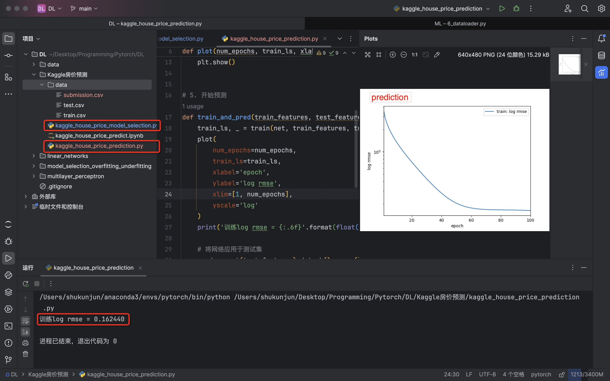

# Kaggle房价预测

主题：模型选择、预测


## 1 模型选择

读取数据，K-折交叉验证，选择最优的超参数

```python
import numpy as np
import pandas as pd
import torch
import torchvision
from torch import nn
from d2l import torch as d2l
from torch.utils.data import DataLoader, TensorDataset

train_data = pd.read_csv('./data/train.csv')
test_data = pd.read_csv('./data/test.csv')  # test 实则是 valid

# 训练数据集包括1460个样本，每个样本80个特征和1个标签
# 测试数据集包含1459个样本，每个样本80个特征
# print(train_data.shape)
# print(valid_data.shape)

# 在每个样本中，第一个特征是ID，删除
all_features = pd.concat((train_data.iloc[:, 1:-1], test_data.iloc[:, 1:]))

# 1. 数据预处理
# 若无法获得测试数据，则可根据训练数据计算均值和标准差(缩放到零均值和单位方差 miu=0, sigma=1)
numeric_features = all_features.dtypes[all_features.dtypes != 'object'].index  # 数值类型特征
all_features[numeric_features] = all_features[numeric_features].apply(lambda x: (x - x.mean()) / (x.std()))

# 在标准化数据之后，所有均值消失，因此我们可以将缺失值设置为0
all_features[numeric_features] = all_features[numeric_features].fillna(0)

# "Dummy_na=True" 将 "NA" (缺失值) 视为有效的特征值，并为其创建指示符特征，对于离散值，采用one-hot编码
all_features = pd.get_dummies(all_features, dummy_na=True)  # 此转换会将特征的总数量从79个增加到331个

# 从pandas格式中提取NumPy格式，并将其转换为张量tensor表示用于训练
n_train = train_data.shape[0]
train_features = torch.tensor(all_features[:n_train].values, dtype=torch.float32)
test_features = torch.tensor(all_features[n_train:].values, dtype=torch.float32)
train_labels = torch.tensor(train_data.SalePrice.values.reshape(-1, 1), dtype=torch.float32)

# 2. 开始训练
loss_fn = nn.MSELoss()
in_features = train_features.shape[1]

# 采用单层线性回归
net = nn.Sequential(nn.Linear(in_features=in_features, out_features=1))


# 更关心相对误差 (y - y_hat)/y 而不是绝对误差 (y - y_hat)
# 修改损失函数为 (log(yi) - log(yi_hat))**2 求和后除以 n 然后开根号
def log_rmse(net, features, labels):
    # 这一步仅仅为了在取对数时进一步稳定该值，将小于1的值设置为1
    clipped_preds = torch.clamp(net(features), 1, float('inf'))
    rmse = torch.sqrt(loss_fn(torch.log(clipped_preds), torch.log(labels)))
    return rmse.item()


# 训练函数
def train(net, train_features, train_labels, test_features, test_labels, num_epochs, learning_rate, weight_decay,
          batch_size):
    train_ls, test_ls = [], []

    # 优化器Adam
    learning_rate = learning_rate
    optimizer = torch.optim.Adam(
        params=net.parameters(),
        lr=learning_rate,
        weight_decay=weight_decay,
    )

    # 训练数据转换为DataLoader
    train_datasets = TensorDataset(train_features, train_labels)
    train_loaders = DataLoader(train_datasets, batch_size=batch_size, shuffle=True)

    # 这里使用的是Adam优化算法
    for epoch in range(num_epochs):
        for X, y in train_loaders:
            l = loss_fn(net(X), y)
            optimizer.zero_grad()
            l.backward()
            optimizer.step()
        train_ls.append(log_rmse(net, train_features, train_labels))

        if test_labels is not None:
            test_ls.append(log_rmse(net, test_features, test_labels))

    return train_ls, test_ls


# 3. K-折交叉验证
def get_k_fold_data(k, i, X, y):
    assert k > 1
    fold_size = X.shape[0] // k
    X_train, y_train = None, None
    for j in range(k):
        idx = slice(j * fold_size, (j + 1) * fold_size)
        X_part, y_part = X[idx, :], y[idx]
        if j == i:
            X_valid, y_valid = X_part, y_part
        elif X_train is None:
            X_train, y_train = X_part, y_part
        else:
            X_train = torch.cat([X_train, X_part], 0)
            y_train = torch.cat([y_train, y_part], 0)
    return X_train, y_train, X_valid, y_valid


# 当我们在K-折交叉验证中训练K次后，返回训练和验证误差的平均值
def k_fold(k, X_train, y_train, num_epochs, learning_rate, weight_decay, batch_size):
    train_l_sum, valid_l_sum = 0, 0
    for i in range(k):
        data = get_k_fold_data(k, i, X_train, y_train)
        train_ls, valid_ls = train(net, *data, num_epochs, learning_rate, weight_decay, batch_size)
        train_l_sum += train_ls[-1]
        valid_l_sum += valid_ls[-1]
        if i == 0:
            d2l.plot(list(range(1, num_epochs + 1)), [train_ls, valid_ls],
                     xlabel='epoch', ylabel='rmse', xlim=[1, num_epochs],
                     legend=['train', 'valid'], yscale='log')
        print(
            '折{}，训练log rmse = {:.6f}, 验证log rmse = {:.6f}'.format(i + 1, float(train_ls[-1]), float(valid_ls[-1])))

    return train_l_sum / k, valid_l_sum / k


# 4. 模型选择(即利用K-折交叉验证，选择最优的超参数，然后在对所有训练集进行训练)
k, num_epochs, lr, weight_decay, batch_size = 5, 100, 5, 0, 64
''' 选择完后可以注释 '''
train_l, valid_l = k_fold(k, train_features, train_labels, num_epochs, lr, weight_decay, batch_size)
print('{}-折验证: 平均训练log rmse = {:.6f}, 平均验证log rmse = {:.6f}'.format(k, float(train_l), float(valid_l)))
```


## 2 预测

带入超参数，训练整个训练数据集，得到预测值，存入csv文件

```python
from kaggle_house_price_model_selection import *
import matplotlib.pyplot as plt


# 画图
def plot(num_epochs, train_ls, xlabel, ylabel, xlim, yscale):
    plt.plot(np.arange(1, num_epochs + 1), train_ls, label='train: log rmse')
    plt.xlabel(xlabel)
    plt.ylabel(ylabel)
    plt.xlim(xlim)
    plt.yscale(yscale)
    plt.legend()
    plt.show()


# 5. 开始预测
def train_and_pred(train_features, test_features, train_labels, test_data, num_epochs, lr, weight_decay, batch_size):
    train_ls, _ = train(net, train_features, train_labels, None, None, num_epochs, lr, weight_decay, batch_size)
    plot(
        num_epochs=num_epochs,
        train_ls=train_ls,
        xlabel='epoch',
        ylabel='log rmse',
        xlim=[1, num_epochs],
        yscale='log'
    )
    print('训练log rmse = {:.6f}'.format(float(train_ls[-1])))

    # 将网络应用于测试集
    preds = net(test_features).detach().numpy()

    # 将其重新格式化导出为文件'submission.csv'
    test_data['SalePrice'] = pd.Series(preds.reshape(1, -1)[0])
    submission = pd.concat([test_data['Id'], test_data['SalePrice']], axis=1)
    submission.to_csv('./data/submission.csv', index=False)


# 6. 预测
k, num_epochs, lr, weight_decay, batch_size = 5, 100, 5, 0, 64
train_and_pred(train_features, test_features, train_labels, test_data, num_epochs, lr, weight_decay, batch_size)
```




## 3 Kaggle提交

- 登录Kaggle网站，访问房价预测竞赛页面。
- 点击“Submit Predictions”或“Late Submission”按钮（在撰写本文时，该按钮位于右侧）。
- 点击页面底部虚线框中的“Upload Submission File”按钮，选择要上传的预测文件。
- 点击页面底部的“Make Submission”按钮，即可查看结果。

