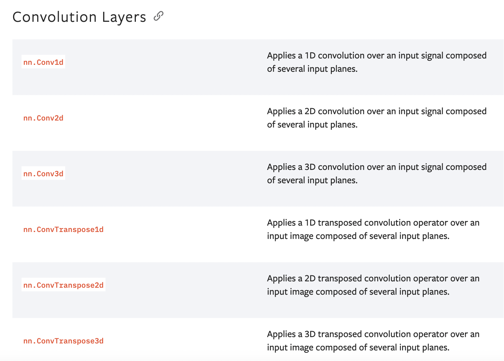
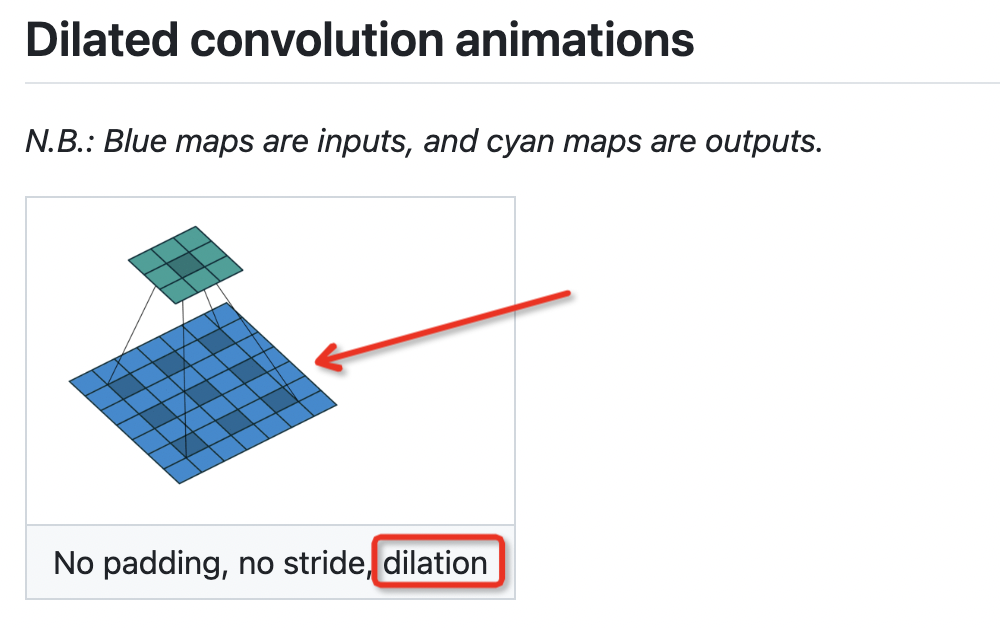
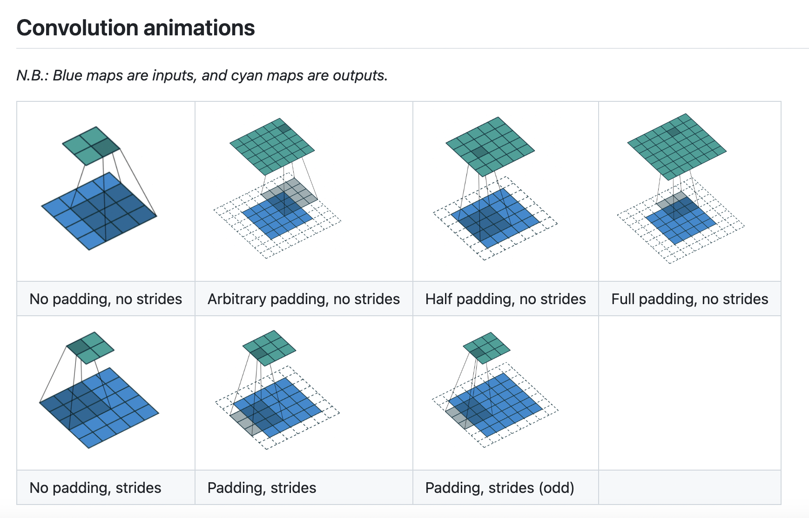
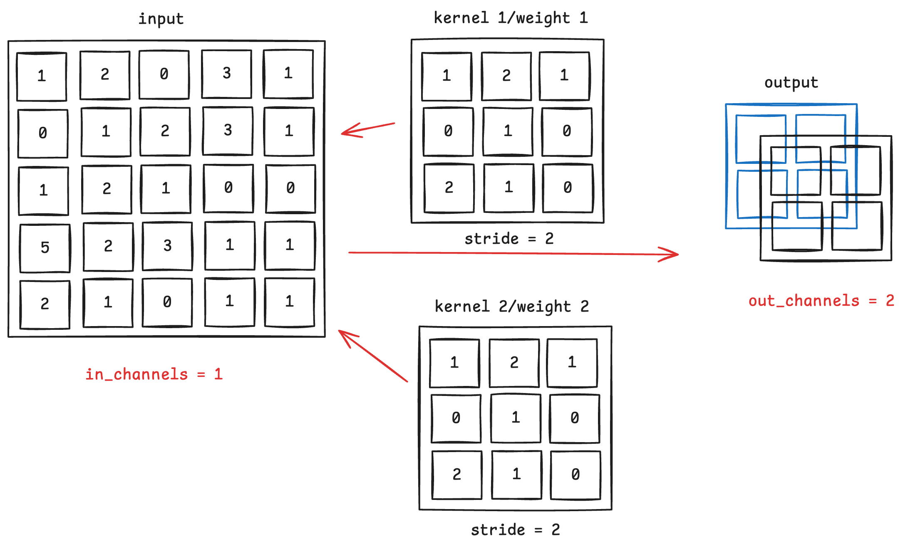
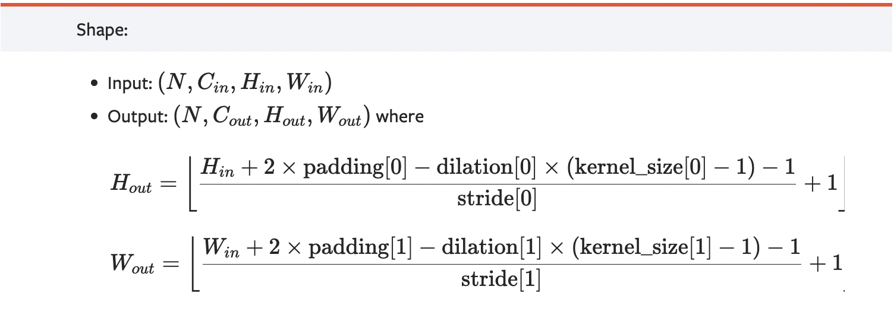

# 卷积神经网络


## 1 卷积层

### 1. Convolution



### 2. 调用和参数

- 调用

```python
class torch.nn.Conv2d(in_channels, out_channels, kernel_size, stride=1, padding=0, dilation=1, groups=1, bias=True, padding_mode='zeros')
```

- 参数

```python
# in_channels: 输入
- in_channels (int) – Number of channels in the input image

# out_channels: 输出
- out_channels (int) – Number of channels produced by the convolution

# kernel_size: 卷积核的大小
- kernel_size (int or tuple) – Size of the convolving kernel

# stride: 步数
- stride (int or tuple, optional) – Stride of the convolution. Default: 1

# padding: 填充层数
- padding (int or tuple, optional) – Zero-padding added to both sides of the input. Default: 0

# padding_mode: 填充方式
- padding_mode (string, optional) – 'zeros', 'reflect', 'replicate' or 'circular'. Default: 'zeros'

# dilation: 卷积核中元素的对应位置
- dilation (int or tuple, optional) – Spacing between kernel elements. Default: 1

- groups (int, optional) – Number of blocked connections from input channels to output channels. Default: 1

- bias (bool, optional) – If True, adds a learnable bias to the output. Default: True
```

- dilation




### 3. 简单原理



- in_channels & out_channels



### 4. 示例代码

```python
import torch
import torchvision
from torch.nn import Conv2d
from torch.utils.data import DataLoader

dataset = torchvision.datasets.CIFAR10(
    "./dataset", 
    train=False, 
    transform=torchvision.transforms.ToTensor(),                                   
    download=False)

dataloader = DataLoader(dataset, batch_size=64)


class Net(torch.nn.Module):
    def __init__(self):
        super(Net, self).__init__()
        self.conv1 = Conv2d(in_channels=3, out_channels=6, kernel_size=3, stride=1, padding=0)

    def forward(self, x):
        x = self.conv1(x)
        return x

my_net = Net()
print(my_net)
```

```python
# 网络结构
Net(
  (conv1): Conv2d(3, 6, kernel_size=(3, 3), stride=(1, 1))
)
```

```python
# 在tensorboard展示
writer = SummaryWriter("./logs_conv")
step = 0
my_net = Net()
for data in dataloader:
    imgs, targets = data
    output = my_net(imgs)
    writer.add_images("input", imgs, step)
    # writer.add_images("output", output, step)  # torch.Size([64, 6, 30, 30]) output的channel=6，报错
    output = torch.reshape(output, (-1, 3, 30, 30))
    writer.add_images("output", output, step)
    step += 1
```

如果希望卷积后，通道变多，但尺寸不变，则需要填充padding，公式




