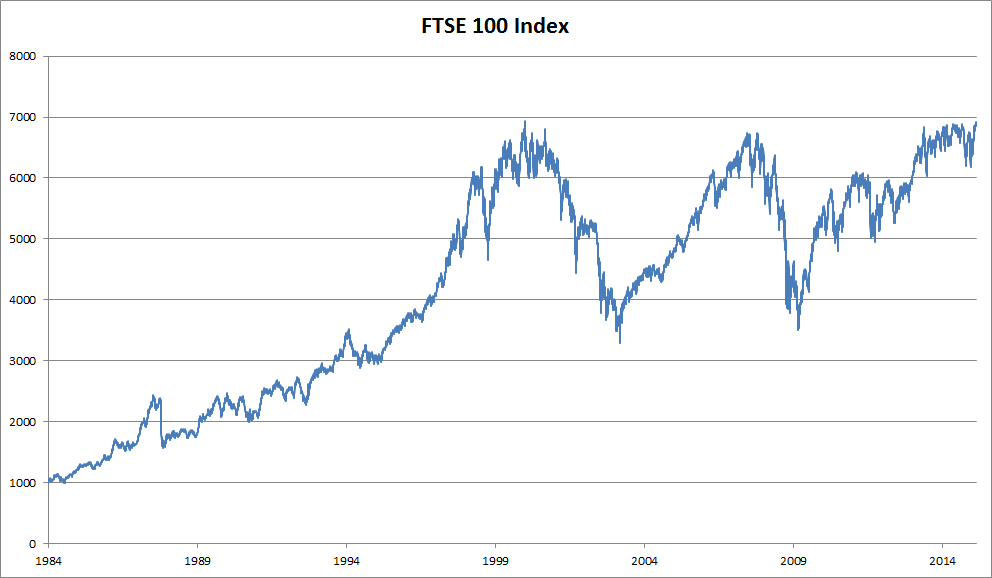
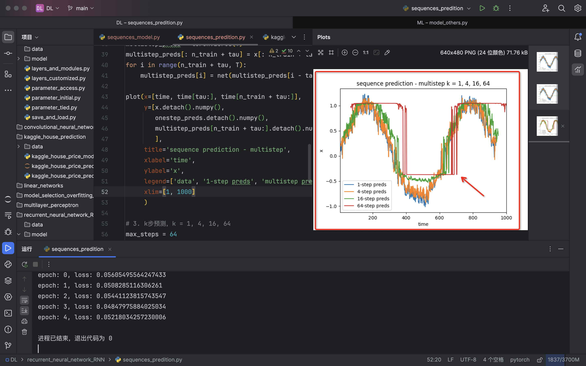

# 循环神经网络RNN - 序列模型


## 1 统计工具

处理序列数据需要统计工具和新的深度神经网络架构。 为了简单起见，以股票价格（富时100指数）为例。



其中，用 $x_t$ 表示价格，即在*时间步*（time step） t∈Z+时，观察到的价格 $x_t$ 。 请注意，$t$ 对于本文中的序列通常是离散的，并在整数或其子集上变化。 假设一个交易员想在t日的股市中表现良好，于是通过以下途径预测 $x_t$ ：
$$
x_t \sim P(x_t | x_{t-1}, x_{t-2}, ..., x_1)
$$


### 1. 自回归模型

#### - Method1 *自回归模型*

假设在现实情况下相当长的序列 $x_{t−1}, ..., x_1$ 可能是不必要的， 因此我们只需要满足某个长度为 $ τ $ 的时间跨度， 即使用观测序列 $ x_{t−1}, ..., x_{t−τ} $ 。当下获得的最直接的好处就是参数的数量总是不变的， 至少在 $ t > τ $ 时如此，这就使我们能够训练一个上面提及的深度网络。 这种模型被称为*自回归模型*（autoregressive models）， 因为它们是对自己执行回归。
$$
x_t \sim P(x_t | x_{t-1}, x_{t-2}, ..., x_{t−τ})
$$


#### - Method2 *隐变量自回归模型*

第二种策略，如图所示， 是保留一些对过去观测的总结 $ h_t $ ， 并且同时更新预测 $ \hat{x_t} $ 和总结 $ h_t $ 。 这就产生了基于 $\hat{x_{t}} = P(x_t ∣ h_t)$ 估计 $ x_t $ ， 以及公式 $ h_t = g(h_{t−1}, x_{t−1}) $ 更新的模型。 由于 $ h_t $ 从未被观测到，这类模型也被称为 *隐变量自回归模型*（latent autoregressive models）。
$$
x_t \sim P(x_t | h_t)
$$

$$
h_t = g(h_{t-1}, x_{t-1})=g(x_{t-1}, x_{t-2}, ..., x_1)
$$


### 2. 马尔可夫模型

我们使用 $ x_{t−1}, ..., x_{t−τ} $ 而不是 $  x_{t−1}, ..., x_{1}  $ 来估计 $ x_t $ 。 只要这种是近似精确的，我们就说序列满足*马尔可夫条件*（Markov condition）。 特别是，如果 $ τ = 1 $ ，得到一个 *一阶马尔可夫模型*（first-order Markov model）， P(x)由下式给出：
$$
P(x_1, x_2, ..., x_T) = \prod_{t=1}^{T}P(x_t \mid x_{t-1}) \space  \space when  \space  \space P(x_1 \mid x_0) = P(x_1)
$$


### 3. 因果关系

原则上，将 $ P(x_1, ..., x_T) $ 倒序展开也没什么问题。 毕竟，基于条件概率公式，我们总是可以写出：
$$
P(x_1, x_2, ..., x_T) = \prod_{t=T}^{1}P(x_t \mid x_{t+1}, x_{t+2}, ..., x_{T})
$$

## 2 代码案例

### 1. 训练

#### - 生成数据

首先，我们生成一些数据：使用正弦函数和一些可加性噪声来生成序列数据， 时间步为1, 2, ..., 1000。

```python
from matplotlib import pyplot as plt
import torch
from torch import nn


def plot(x, y, title, xlabel, ylabel, xlim):
    plt.plot(x, y, label='Series')
    plt.title(title)
    plt.xlabel(xlabel)
    plt.ylabel(ylabel)
    plt.xlim(xlim)
    plt.legend()
    plt.show()

# 1. 生成数据
T = 1000  # 总共产生1000个点, 横轴
time = torch.arange(1, T + 1, dtype=torch.float32)
x = torch.sin(0.01 * time) + torch.normal(0, 0.2, (T,))

plot(x=time, y=x, title='sequences_model', xlabel='time', ylabel='x', xlim=[1, 1000])
```


#### 

#### - 特征 - 标签对

接下来，我们将这个序列转换为模型的*特征－标签*（feature-label）对。 

- 基于嵌入维度$τ$，我们将数据映射为数据对: $ y_t = x_t $ 和 $ \mathbf{x_t} = [x_{t−τ}, ..., x_{t−1}] $

这比我们提供的数据样本少了$τ$个， 因为我们没有足够的历史记录来描述前$τ$个数据样本。

 一个简单的解决办法是：如果拥有足够长的序列就丢弃这几项； 另一个方法是用零填充序列。 在这里，我们仅使用前600个“特征－标签”对进行训练。

```python
# 2. 转换为模型的 特征－标签对
tau = 4
features = torch.zeros((T - tau, tau))  # T - tau 行, tau 列, 初始化这个特征矩阵
# 如果 x = [x1, x2, x3, x4, x5, x6, x7, x8] 是一个时间序列，T = 8
# 设定 tau = 3，则我们的任务是通过 [x1, x2, x3] 来预测 x4，通过 [x2, x3, x4] 来预测 x5，以此类推。
for i in range(tau):
    features[:, i] = x[i: T - tau + i]
labels = x[tau:].reshape((-1, 1))

batch_size, n_train = 16, 600
# 只有前n_train个样本用于训练
train_dataset = TensorDataset(features[:n_train], labels[:n_train])
train_iter = DataLoader(train_dataset, batch_size=batch_size, shuffle=True)
```


#### - 搭建网络

我们使用一个相当简单的架构训练模型： 一个拥有两个全连接层的多层感知机，ReLU激活函数和平方损失

```python
# 3. 搭建网络
# 初始化网络权重的函数
def init_weights(m):
    if type(m) == nn.Linear:
        nn.init.xavier_uniform_(m.weight)


# 一个简单的多层感知机
def get_net():
    net = nn.Sequential(
        nn.Linear(in_features=4, out_features=10),
        nn.ReLU(),
        nn.Linear(in_features=10, out_features1))
    net.apply(init_weights)
    return net


# 平方损失。注意：MSELoss计算平方误差时不带系数1/2
# 当 reduction='none' 时，nn.MSELoss 不会对损失值进行任何归约操作，而是返回一个与输入形状相同的张量，其中每个元素对应输入样本的损失
# 当 reduction='mean' or 'sum' 时，返回标量
loss_fn = nn.MSELoss(reduction='none')
```


#### - 开始训练

```python
# 4. 开始训练
def train(net, train_iter, loss_fn, epochs, lr):
    trainer = torch.optim.Adam(net.parameters(), lr)
    for epoch in range(epochs):
        for X, y in train_iter:
            trainer.zero_grad()
            l = loss_fn(net(X), y)
            l.sum().backward()
            trainer.step()
        print("epoch: {}, loss: {}".format(epoch, l))


net = get_net()
train(net, train_iter, loss_fn, 6, 0.01)

"""
或者
"""
# 4. 开始训练
def train(net, train_iter, loss_fn, epochs, lr):
    trainer = torch.optim.Adam(net.parameters(), lr)
    for epoch in range(epochs):
        for X, y in train_iter:
            trainer.zero_grad()
            l = loss_fn(net(X), y)
            l.backward()
            trainer.step()
        print("epoch: {}, loss: {}".format(epoch, d2l.evaluate_loss(net, train_iter, loss_fn)))  # 评估的是损失平均到参与训练的样本的平均损失


net = get_net()
train(net, train_iter, loss_fn, 6, 0.01)
```

```python
>>> epoch: 0, loss: 0.06545867212116718
>>> epoch: 1, loss: 0.05782567133734885
>>> epoch: 2, loss: 0.05475762417834056
>>> epoch: 3, loss: 0.052261090788402055
>>> epoch: 4, loss: 0.051435601211300024
>>> epoch: 5, loss: 0.050815936521087825
```


### 2. 预测

#### - 单步预测

首先是检查模型预测下一个时间步的能力， 也就是*单步预测*（one-step-ahead prediction）。

即在本案例中用前$\tau$个点预测第$\tau+1$个点，而不预测后面的点
$$
x_{T-\tau}, ..., x_{T-2}, x_{T-1} \sim \hat{x_{T}} \nonumber
$$

$$
x_{T-\tau+1}, ..., x_{T-1}, x_{T} \sim \hat{x_{T+1}} \nonumber
$$

$$
...
$$


#### - k步预测

之前的例子，我们是在前600个数据对进行了训练，然后利用原有的1000-4组样本进行的预测，所以结果良好。但我们如果在预测的数据上进一步预测，效果就不尽如人意了。
$$
x_{T-\tau}, ..., x_{T-2}, x_{T-1} \sim \hat{x_{T}} \nonumber
$$

$$
x_{T-\tau+1}, ..., x_{T-1}, \hat{x_{T}} \sim \hat{x_{T+1}} \nonumber
$$

$$
x_{T-\tau+1}, ..., \hat{x_{T}}, \hat{x_{T+1}} \sim \hat{x_{T+2}} \nonumber
$$

$$
...
$$

```python
multistep_preds = torch.zeros(T)
multistep_preds[: n_train + tau] = x[: n_train + tau]
for i in range(n_train + tau, T):
    multistep_preds[i] = net(multistep_preds[i - tau:i].reshape((1, -1)))

plot(x=[time, time[tau:], time[n_train + tau:]],
     y=[x.detach().numpy(), onestep_preds.detach().numpy(),
        multistep_preds[n_train + tau:].detach().numpy(),
        ],
     title='sequence prediction - multistep',
     xlabel='time',
     ylabel='x',
     legend=['data', '1-step preds', 'multistep preds'],
     xlim=[1, 1000]
     )
```


- 基于$ k=1, 4, 16, 64$ ，通过对整个序列预测的计算， 让我们更仔细地看一下k步预测的困难。

```python
max_steps = 64

features = torch.zeros((T - tau - max_steps + 1, tau + max_steps))
# 列i（i<tau）是来自x的观测，其时间步从（i）到（i+T-tau-max_steps+1）
for i in range(tau):
    features[:, i] = x[i: i + T - tau - max_steps + 1]

# 列i（i>=tau）是来自（i-tau+1）步的预测，其时间步从（i）到（i+T-tau-max_steps+1）
for i in range(tau, tau + max_steps):
    features[:, i] = net(features[:, i - tau:i]).reshape(-1)

steps = (1, 4, 16, 64)
plot(x=[time[tau + i - 1: T - max_steps + i] for i in steps],
     y=[features[:, (tau + i - 1)].detach().numpy() for i in steps],
     title='sequence prediction - multistep k = 1, 4, 16, 64',
     xlabel='time',
     ylabel='x',
     legend=[f'{i}-step preds' for i in steps],
     xlim=[5, 1000],
     )
```




