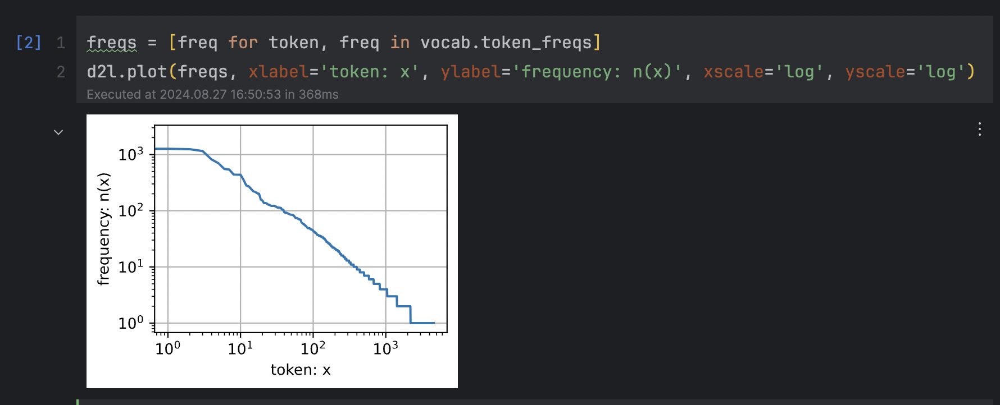
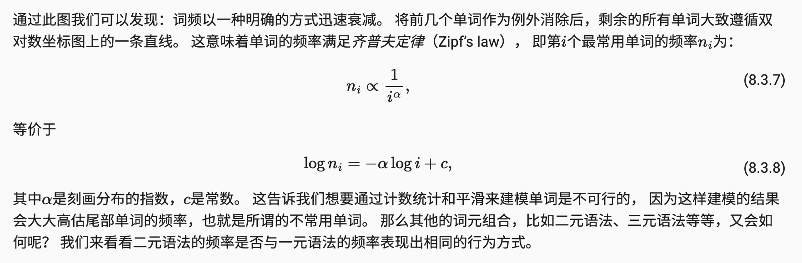
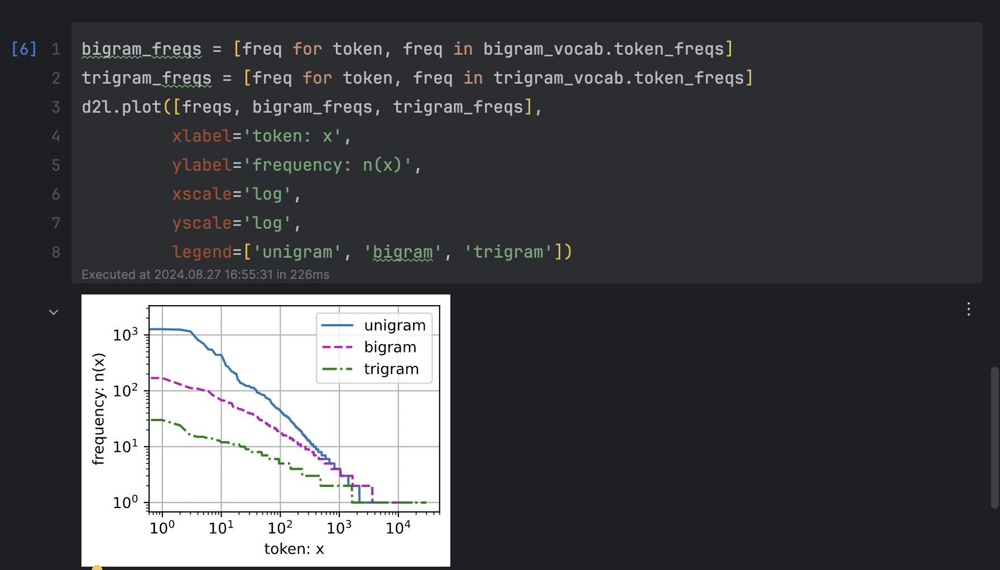

# 循环神经网络RNN - 文本预处理和语言模型

主题：文本预处理、语言模型


## 1 文本预处理

### 1. 读取数据集

首先，我们从H.G.Well的[时光机器](https://www.gutenberg.org/ebooks/35)中加载文本。 这是一个相当小的语料库，只有30000多个单词。下面的函数将数据集读取到由多条文本行组成的列表中，其中每条文本行都是一个字符串。 为简单起见，我们在这里忽略了标点符号和字母大写。

```python
import re


def read_time_machine():  # @save
    """将时间机器数据集加载到文本行的列表中"""
    with open('time_machine.txt', 'r') as f:
        lines = f.readlines()
    return [re.sub('[^A-Za-z]+', ' ', line).strip().lower() for line in lines]


lines = read_time_machine()
print(f'# 文本总行数: {len(lines)}')
print(lines[0])
print(lines[10])
```

```python
>>> # 文本总行数: 3221
>>> the time machine by h g wells
>>> twinkled and his usually pale face was flushed and animated the
```

 

### 2. 词元化

下面的`tokenize`函数将文本行列表（`lines`）作为输入， 列表中的每个元素是一个文本序列（如一条文本行）。 每个文本序列又被拆分成一个词元列表，*词元*（token）是文本的基本单位。 最后，返回一个由词元列表组成的列表，其中的每个词元都是一个字符串（string）。

```python
def tokenize(lines, token='word'):  #@save
    """将文本行拆分为单词或字符词元"""
    if token == 'word':
        return [line.split() for line in lines]
    elif token == 'char':
        return [list(line) for line in lines]
    else:
        print('错误：未知词元类型：' + token)

tokens = tokenize(lines)
for i in range(11):
    print(tokens[i])
```


### 3. 词表

词元的类型是字符串，而模型需要的输入是数字，因此这种类型不方便模型使用。 现在，让我们构建一个字典，通常也叫做*词汇表*（vocabulary）， 用来将字符串类型的词元映射到从0开始的数字索引中。 

我们先将训练集中的所有文档合并在一起，对它们的唯一词元进行统计， 得到的统计结果称之为*语料*（corpus）。 

然后根据每个唯一词元的出现频率，为其分配一个数字索引。 很少出现的词元通常被移除，这可以降低复杂性。 另外，语料库中不存在或已删除的任何词元都将映射到一个特定的未知词元“<unk>”。 我们可以选择增加一个列表，用于保存那些被保留的词元， 例如：填充词元（“<pad>”）； 序列开始词元（“<bos>”）； 序列结束词元（“<eos>”）。

```python
import collections


class Vocab:  #@save
    """文本词表"""

    def __init__(self, tokens=None, min_freq=0, reserved_tokens=None):
        '''
        :param tokens: 传入词元
        :param min_freq: 最小词频，出现过少则不要 
        :param reserved_tokens: 
        '''
        if tokens is None:
            tokens = []
        if reserved_tokens is None:
            reserved_tokens = []
        # 按出现频率排序
        counter = count_corpus(tokens)
        self._token_freqs = sorted(counter.items(), key=lambda x: x[1], reverse=True)
        # 未知词元的索引为0
        self.idx_to_token = ['<unk>'] + reserved_tokens
        self.token_to_idx = {token: idx for idx, token in enumerate(self.idx_to_token)}
        for token, freq in self._token_freqs:
            if freq < min_freq:
                break
            if token not in self.token_to_idx:
                self.idx_to_token.append(token)
                self.token_to_idx[token] = len(self.idx_to_token) - 1

    def __len__(self):
        return len(self.idx_to_token)

    def __getitem__(self, tokens):
        if not isinstance(tokens, (list, tuple)):
            return self.token_to_idx.get(tokens, self.unk)
        return [self.__getitem__(token) for token in tokens]

    def to_tokens(self, indices):
        if not isinstance(indices, (list, tuple)):
            return self.idx_to_token[indices]
        return [self.idx_to_token[index] for index in indices]

    @property
    def unk(self):  # 未知词元的索引为0
        return 0

    @property
    def token_freqs(self):
        return self._token_freqs


def count_corpus(tokens):  #@save
    """统计词元的频率"""
    # 这里的tokens是1D列表或2D列表
    if len(tokens) == 0 or isinstance(tokens[0], list):
        # 将词元列表展平成一个列表
        tokens = [token for line in tokens for token in line]
    return collections.Counter(tokens)
```


- 使用：我们首先使用时光机器数据集作为语料库来构建词表，然后打印前几个高频词元及其索引。

```python
vocab = Vocab(tokens)
print(list(vocab.token_to_idx.items())[:10])
```

```python
# 出现极少词下标0，高频词小下标，低频词大下标
>>> [('<unk>', 0), ('the', 1), ('i', 2), ('and', 3), ('of', 4), ('a', 5), ('to', 6), >>>  ('was', 7), ('in', 8), ('that', 9)]
```


- 现在，我们可以将每一条文本行转换成一个数字索引列表。

```python
for i in [0, 10]:
    print('文本:', tokens[i])
    print('索引:', vocab[tokens[i]])
```

```python
>>> 文本: ['the', 'time', 'machine', 'by', 'h', 'g', 'wells']
>>> 索引: [1, 19, 50, 40, 2183, 2184, 400]
>>> 文本: ['twinkled', 'and', 'his', 'usually', 'pale', 'face', 'was', 'flushed', 
>>>       'and', 'animated', 'the']
>>> 索引: [2186, 3, 25, 1044, 362, 113, 7, 1421, 3, 1045, 1]
```


### 4.整合所有功能

在使用上述函数时，我们将所有功能打包到`load_corpus_time_machine`函数中

 该函数返回`corpus`（词元索引列表）和`vocab`（语料库的词表）。 我们在这里所做的改变是：

1. 为了简化后面章节中的训练，我们使用`字符`（而不是单词）实现文本词元化；
2. time_machine数据集中的每个文本行不一定是一个句子或一个段落，还可能是一个单词，因此返回的`corpus`仅处理为单个列表，而不是使用多词元列表构成的一个列表。

```python
def load_corpus_time_machine(max_tokens=-1):  #@save
    """返回时光机器数据集的词元索引列表和词表"""
    lines = read_time_machine()
    tokens = tokenize(lines, 'char')
    vocab = Vocab(tokens)
    # 因为时光机器数据集中的每个文本行不一定是一个句子或一个段落，
    # 所以将所有文本行展平到一个列表中
    corpus = [vocab[token] for line in tokens for token in line]
    if max_tokens > 0:
        corpus = corpus[:max_tokens]
    return corpus, vocab

corpus, vocab = load_corpus_time_machine()
len(corpus), len(vocab)
```

```python
>>> (170580, 28)
```


## 2 语言模型

假设长度为$T$的文本序列中的词元依次为$x_1, x_2, ..., x_T$。 于是，$x_t \space (1≤t≤T) $ 可以被认为是文本序列在时间步$t$处的观测或标签。 在给定这样的文本序列时，*语言模型*（language model）的目标是估计序列的联合概率
$$
P(x_1, \space x_2, \space ..., \space x_T)
$$
例如，只需要一次抽取一个词元
$$
x_t \sim P(x_t \mid x_{t−1}, ..., x_1)
$$
 一个理想的语言模型就能够基于模型本身生成自然文本。


### 1. 学习语言模型

让我们从基本概率规则开始：
$$
P(x_1, x_2, \ldots, x_T) = \prod_{t=1}^T P(x_t  \mid  x_1, \ldots, x_{t-1})
$$
例如，包含了四个单词的一个文本序列的概率是：
$$
P(\text{deep}, \text{learning}, \text{is}, \text{fun}) =  P(\text{deep}) P(\text{learning}  \mid  \text{deep}) P(\text{is}  \mid  \text{deep}, \text{learning}) P(\text{fun}  \mid  \text{deep}, \text{learning}, \text{is})
$$
为了训练语言模型，我们需要计算单词的概率，以及给定前面几个单词后出现某个单词的条件概率。这些概率本质上就是语言模型的参数。

例如，可以将估计值$\hat{P}(\text{deep})$计算为任何以单词“deep”开头的句子的概率。一种（稍稍不太精确的）方法是统计单词“deep”在数据集中的出现次数，然后将其除以整个语料库中的单词总数。这种方法效果不错，特别是对于频繁出现的单词。接下来，我们可以尝试估计
$$
\hat{P}(\text{learning} \mid \text{deep}) = \frac{n(\text{deep, learning})}{n(\text{deep})}
$$
其中$n(x)$和$n(x, x')$分别是单个单词和连续单词对的出现次数。

不幸的是，由于连续单词对“deep learning”的出现频率要低得多，所以估计这类单词正确的概率要困难得多。特别是对于一些不常见的单词组合，要想找到足够的出现次数来获得准确的估计可能都不容易。而对于三个或者更多的单词组合，情况会变得更糟。许多合理的三个单词组合可能是存在的，但是在数据集中却找不到。

除非我们提供某种解决方案，来将这些单词组合指定为非零计数，否则将无法在语言模型中使用它们。如果数据集很小，或者单词非常罕见，那么这类单词出现一次的机会可能都找不到。

一种常见的策略是执行某种形式的**拉普拉斯平滑**（Laplace smoothing），具体方法是在所有计数中添加一个小常量。用$n$表示训练集中的单词总数，用$m$表示唯一单词的数量。例如通过：
$$
\begin{aligned}
    \hat{P}(x) & = \frac{n(x) + \epsilon_1/m}{n + \epsilon_1}, \\
    \hat{P}(x' \mid x) & = \frac{n(x, x') + \epsilon_2 \hat{P}(x')}{n(x) + \epsilon_2}, \\
    \hat{P}(x'' \mid x,x') & = \frac{n(x, x',x'') + \epsilon_3 \hat{P}(x'')}{n(x, x') + \epsilon_3}.
\end{aligned}
$$
其中，$\epsilon_1,\epsilon_2$和$\epsilon_3$是超参数。以$\epsilon_1$为例：当$\epsilon_1 = 0$时，不应用平滑；当$\epsilon_1$接近正无穷大时，$\hat{P}(x)$接近均匀概率分布$1/m$。

然而，这样的模型很容易变得无效，原因如下：首先，我们需要存储所有的计数；其次，这完全忽略了单词的意思。例如，“猫”（cat）和“猫科动物”（feline）可能出现在相关的上下文中，但是想根据上下文调整这类模型其实是相当困难的。最后，长单词序列大部分是没出现过的，因此一个模型如果只是简单地统计先前“看到”的单词序列频率，那么模型面对这种问题肯定是表现不佳的。


### 2. 马尔可夫模型与n元语法

在讨论包含深度学习的解决方案之前，我们需要了解更多的概念和术语。如果，
$$
P(x_{t+1} \mid x_t, \ldots, x_1) = P(x_{t+1} \mid x_t)
$$
则序列上的分布满足一阶马尔可夫性质。阶数越高，对应的依赖关系就越长。这种性质推导出了许多可以应用于序列建模的近似公式：
$$
\begin{aligned}
P(x_1, x_2, x_3, x_4) &=  P(x_1) P(x_2) P(x_3) P(x_4),\\
P(x_1, x_2, x_3, x_4) &=  P(x_1) P(x_2  \mid  x_1) P(x_3  \mid  x_2) P(x_4  \mid  x_3),\\
P(x_1, x_2, x_3, x_4) &=  P(x_1) P(x_2  \mid  x_1) P(x_3  \mid  x_1, x_2) P(x_4  \mid  x_2, x_3).
\end{aligned}
$$
通常，涉及一个、两个和三个变量的概率公式分别被称为**一元语法**（unigram）、**二元语法**（bigram）和**三元语法**（trigram）模型。下面，我们将学习如何去设计更好的模型。


### 3. 自然语言统计[不推荐]

我们看看在真实数据上如果进行自然语言统计。 根据time_machine数据集构建词表， 并打印前10个最常用的（频率最高的）单词。

```python
import random
import torch
from d2l import torch as d2l

tokens = d2l.tokenize(d2l.read_time_machine())
# 因为每个文本行不一定是一个句子或一个段落，因此我们把所有文本行拼接到一起
corpus = [token for line in tokens for token in line]
vocab = d2l.Vocab(corpus)
vocab.token_freqs[:10]
```

```python
>>> [('the', 2261),
>>>  ('i', 1267),
>>>  ...
>>>  ('that', 443),
>>>  ('my', 440)]
```


正如我们所看到的，高频词词看起来很无意义， 这些词通常被称为*停用词*（stop words），因此可以被过滤掉。 尽管如此，它们本身仍然是有意义的，我们仍然会在模型中使用它们。 此外，还有个明显的问题是词频衰减的速度相当地快。 例如，最常用单词的词频对比，第10个还不到第1个的1/5。 为了更好地理解，我们可以画出的词频图：

```python
freqs = [freq for token, freq in vocab.token_freqs]
d2l.plot(freqs, xlabel='token: x', ylabel='frequency: n(x)', xscale='log', yscale='log')
```





- 二元语法

```python
bigram_tokens = [pair for pair in zip(corpus[:-1], corpus[1:])]
bigram_vocab = d2l.Vocab(bigram_tokens)
bigram_vocab.token_freqs[:10]
```

```python
>>> [(('of', 'the'), 309),
>>>  (('in', 'the'), 169),
>>>  ...
>>>  (('as', 'i'), 78),
>>>  (('of', 'a'), 73)]
```

- 三元语法

这里值得注意：在十个最频繁的词对中，有九个是由两个停用词组成的， 只有一个与“the time”有关。 我们再进一步看看三元语法的频率是否表现出相同的行为方式。

```python
trigram_tokens = [triple for triple in zip(corpus[:-2], corpus[1:-1], corpus[2:])]
trigram_vocab = d2l.Vocab(trigram_tokens)
trigram_vocab.token_freqs[:10]
```

```python
>>> [(('the', 'time', 'traveller'), 59),
>>>  (('the', 'time', 'machine'), 30),
>>>  ...
>>>  (('i', 'saw', 'the'), 13),
>>>  (('i', 'began', 'to'), 13)]
```


最后，我们直观地对比三种模型中的词元频率：一元语法、二元语法和三元语法。

```python
bigram_freqs = [freq for token, freq in bigram_vocab.token_freqs]
trigram_freqs = [freq for token, freq in trigram_vocab.token_freqs]
d2l.plot([freqs, bigram_freqs, trigram_freqs],
         xlabel='token: x',
         ylabel='frequency: n(x)',
         xscale='log',
         yscale='log',
         legend=['unigram', 'bigram', 'trigram'])
```



这张图非常令人振奋！原因有很多：

1. 除了一元语法词，单词序列似乎也遵循齐普夫定律， 尽管公式(8.3.7)中的指数α更小 （指数的大小受序列长度的影响）；
2. 词表中n元组的数量并没有那么大，这说明语言中存在相当多的结构， 这些结构给了我们应用模型的希望；
3. 很多n元组很少出现，这使得拉普拉斯平滑非常不适合语言建模。 作为代替，我们将使用基于深度学习的模型。


### 3. 读取长序列数据

首先，由于文本序列可以是任意长的， 例如整本《时光机器》（*The Time Machine*）， 于是任意长的序列可以被我们划分为具有相同时间步数的子序列。 当训练我们的神经网络时，这样的小批量子序列将被输入到模型中。 

假设网络一次只处理具有n个时间步的子序列。例如n=5，并且每个时间步的词元对应于一个字符。 请注意，因为我们可以选择任意偏移量来指示初始位置，所以我们有相当大的自由度。


我们可以从随机偏移量开始划分序列，以同时获得*覆盖性*（coverage）和*随机性*（randomness）。 下面，我们将描述如何实现*随机采样*（random sampling）和 *顺序分区*（sequential partitioning）策略。

- 随机采样
- 顺序分区


#### - 随机采样

下面的代码每次可以从数据中随机生成一个小批量。 在这里，参数`batch_size`指定了每个小批量中子序列样本的数目， 参数`num_steps`是每个子序列中预定义的时间步数。

```python
def seq_data_iter_random(corpus, batch_size, num_steps):  #@save
    """使用随机抽样生成一个小批量子序列"""
    # 从随机偏移量开始对序列进行分区，随机范围包括num_steps-1
    corpus = corpus[random.randint(0, num_steps - 1):]
    # 减去1，是因为我们需要考虑标签
    num_subseqs = (len(corpus) - 1) // num_steps
    # 长度为num_steps的子序列的起始索引
    initial_indices = list(range(0, num_subseqs * num_steps, num_steps))
    # 在随机抽样的迭代过程中，
    # 来自两个相邻的、随机的、小批量中的子序列不一定在原始序列上相邻
    random.shuffle(initial_indices)

    def data(pos):
        # 返回从pos位置开始的长度为num_steps的序列
        return corpus[pos: pos + num_steps]

    num_batches = num_subseqs // batch_size
    for i in range(0, batch_size * num_batches, batch_size):
        # 在这里，initial_indices包含子序列的随机起始索引
        initial_indices_per_batch = initial_indices[i: i + batch_size]
        X = [data(j) for j in initial_indices_per_batch]
        Y = [data(j + 1) for j in initial_indices_per_batch]
        yield torch.tensor(X), torch.tensor(Y)
```

下面我们生成一个从0到34的序列。 假设批量大小为2，时间步数为5，这意味着可以生成 ⌊(35−1)/5⌋=6个 “特征－标签”子序列对。 如果设置小批量大小为2，我们只能得到3个小批量。

```python
my_seq = list(range(35))
for X, Y in seq_data_iter_random(my_seq, batch_size=2, num_steps=5):
    print('X: ', X, '\nY:', Y)
```

```python
>>> X:  tensor([[13, 14, 15, 16, 17],
>>>         [28, 29, 30, 31, 32]])
>>> Y: tensor([[14, 15, 16, 17, 18],
>>>         [29, 30, 31, 32, 33]])
>>> X:  tensor([[ 3,  4,  5,  6,  7],
>>>         [18, 19, 20, 21, 22]])
>>> Y: tensor([[ 4,  5,  6,  7,  8],
>>>         [19, 20, 21, 22, 23]])
>>> X:  tensor([[ 8,  9, 10, 11, 12],
>>>         [23, 24, 25, 26, 27]])
>>> Y: tensor([[ 9, 10, 11, 12, 13],
>>>         [24, 25, 26, 27, 28]])
```


#### - 顺序分区

在迭代过程中，除了对原始序列可以随机抽样外， 我们还可以保证两个相邻的小批量中的子序列在原始序列上也是相邻的。 这种策略在基于小批量的迭代过程中保留了拆分的子序列的顺序，因此称为顺序分区。

```python
def seq_data_iter_sequential(corpus, batch_size, num_steps):  #@save
    """使用顺序分区生成一个小批量子序列"""
    # 从随机偏移量开始划分序列
    offset = random.randint(0, num_steps)
    num_tokens = ((len(corpus) - offset - 1) // batch_size) * batch_size
    Xs = torch.tensor(corpus[offset: offset + num_tokens])
    Ys = torch.tensor(corpus[offset + 1: offset + 1 + num_tokens])
    Xs, Ys = Xs.reshape(batch_size, -1), Ys.reshape(batch_size, -1)
    num_batches = Xs.shape[1] // num_steps
    for i in range(0, num_steps * num_batches, num_steps):
        X = Xs[:, i: i + num_steps]
        Y = Ys[:, i: i + num_steps]
        yield X, Y
```

基于相同的设置，通过顺序分区读取每个小批量的子序列的特征`X`和标签`Y`。 通过将它们打印出来可以发现： 迭代期间来自两个相邻的小批量中的子序列在原始序列中确实是相邻的。

```python
for X, Y in seq_data_iter_sequential(my_seq, batch_size=2, num_steps=5):
    print('X: ', X, '\nY:', Y)
```

```python
>>> X:  tensor([[ 0,  1,  2,  3,  4],
>>>         [17, 18, 19, 20, 21]])
>>> Y: tensor([[ 1,  2,  3,  4,  5],
>>>         [18, 19, 20, 21, 22]])
>>> X:  tensor([[ 5,  6,  7,  8,  9],
>>>         [22, 23, 24, 25, 26]])
>>> Y: tensor([[ 6,  7,  8,  9, 10],
>>>         [23, 24, 25, 26, 27]])
>>> X:  tensor([[10, 11, 12, 13, 14],
>>>         [27, 28, 29, 30, 31]])
>>> Y: tensor([[11, 12, 13, 14, 15],
>>>         [28, 29, 30, 31, 32]])
```


#### - 采样函数包装到一个类

现在，我们将上面的两个采样函数包装到一个类中， 以便稍后可以将其用作数据迭代器。

```python
class SeqDataLoader:  #@save
    """加载序列数据的迭代器"""

    def __init__(self, batch_size, num_steps, use_random_iter, max_tokens):
        if use_random_iter:
            self.data_iter_fn = d2l.seq_data_iter_random
        else:
            self.data_iter_fn = d2l.seq_data_iter_sequential
        self.corpus, self.vocab = d2l.load_corpus_time_machine(max_tokens)
        self.batch_size, self.num_steps = batch_size, num_steps

    def __iter__(self):
        return self.data_iter_fn(self.corpus, self.batch_size, self.num_steps)
```

最后，我们定义了一个函数`load_data_time_machine`， 它同时返回数据迭代器和词表。

```python
def load_data_time_machine(batch_size, num_steps,  #@save
                           use_random_iter=False, max_tokens=10000):
    """返回时光机器数据集的迭代器和词表"""
    data_iter = SeqDataLoader(
        batch_size, num_steps, use_random_iter, max_tokens)
    return data_iter, data_iter.vocab
```


